# 苍穹外卖

## 基础数据模块

### 项目概述

#### 软件开发整体介绍

##### 软件开发流程（从上至下）

1. 需求分析：需求规格说明书、产品原型
2. 设计：UI设计、数据库设计、接口设计
3. 编码：项目代码、单元测试
4. 测试：测试用例、测试报告
5. 上线运维：软件环境安装、配置

##### 角色分工

- 项目经理：对整个项目负责，**任务分配、把控进度**
- 产品经理：进行**需求调研**，输出需求调研文档、产品原型等
- UI设计师：根据产品原型输出**界面效果图**
- 架构师：项目整体**架构设计、技术选型**等
- 开发工程师：代码实现
- 测试工程师：编写测试用例、输出测试报告
- 运维工程师：软件环境搭建、项目上线

##### 软件环境

- 开发环境（development）：开发人员在开发阶段使用的环境，一般外部用户无法访问
- 测试环境（tesing）：专门给测试人员使用的环境，用于测试项目，一般外部用户无法访问
- 生产环境（production）：即线上环境，正式提供对外服务的环境

#### 苍穹外卖项目介绍

##### 项目介绍

**定位：**专门为餐饮企业（餐厅、饭店）定制的一款软件产品

功能架构：体现项目中的业务功能模块

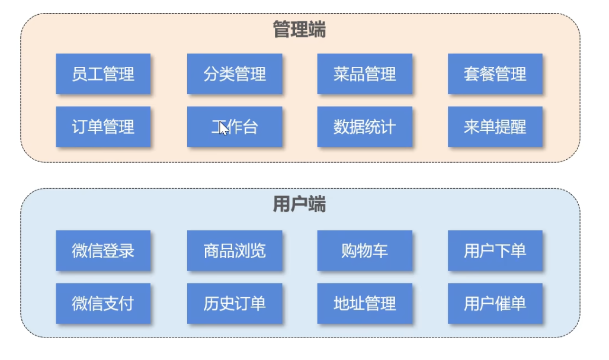

##### 产品原型

**用于展示项目的业务功能，一般由产品经理进行设计**

一般为一组 HTML 网页，内含页面原型和需求介绍以及设计要求

##### 技术选型

**展示项目中使用到的技术框架和中间件等**

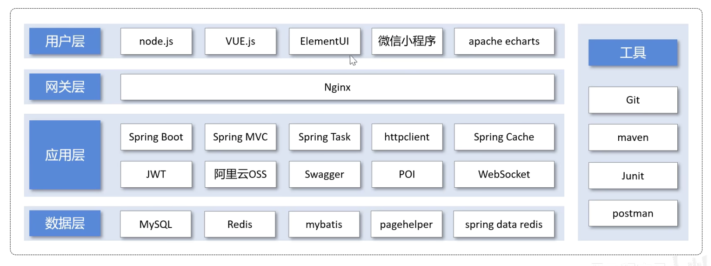

###### 用户层（主要是前端技术）：

- Node.js
- Vue.js
- ElementUI
- 微信小程序
- Apache Echarts

###### 网关层：Nginx

###### 应用层（主要是后端技术）：

- Spring Boot
- Spring MVC
- Spring Task（订单计时）
- HttpClient（发送 HTTP 请求）
- Spring Cache（缓存框架）
- JWT
- 阿里云OSS
- Swagger
- POI（操作 Excel 表格）
- WebSocket（实现催单，来单提醒。一种网络协议）

###### 数据层：

- MySQL
- Redis（数据库缓存中间件）
- MyBatis
- PageHelper
- Spring Data Redis（简化操作 Redis 的一组 API）

###### 工具：

- Git
- JUnit
- Maven
- Postman

### 环境搭建

#### 开发环境搭建

##### 前端环境搭建

###### 整体结构

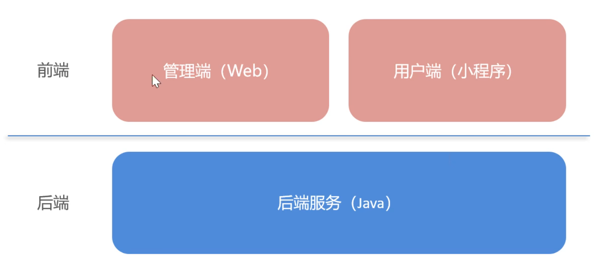

- 双击前端环境 `Nginx` 文件夹中的 `nginx.exe` 启动 nginx 服务，访问端口号为 `80`

- 前端项目已经部署到了 `Nginx` 文件夹中，通过 `localhost:80` 即可访问到前端项目

##### 后端环境搭建

后端工程基于 **Maven** 进行项目构建，并且进行**分模块**开发

###### 项目结构：

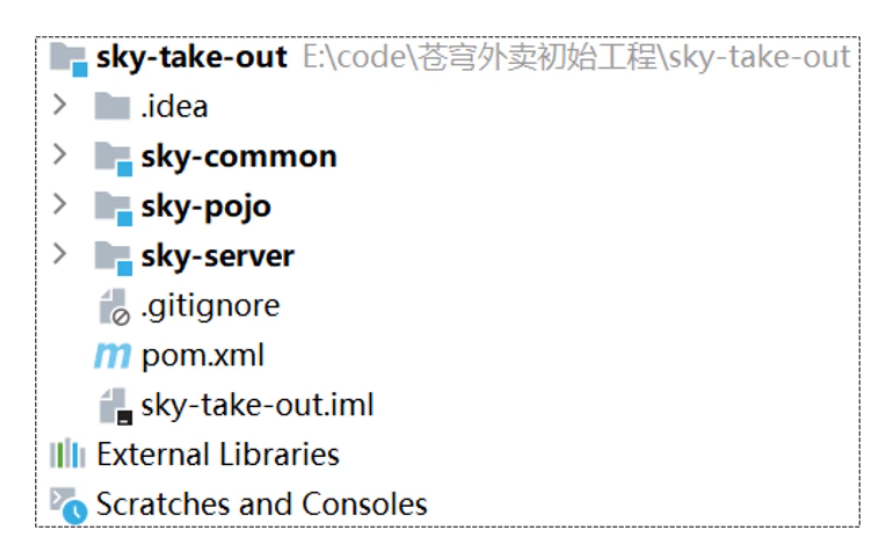

###### 项目各模块说明：

| 名称         | 说明                                                         |
| ------------ | ------------------------------------------------------------ |
| sky-take-out | Maven 父工程，统一管理依赖版本，聚合其他子模块               |
| sky-common   | 子模块，存放公共类，例如：工具类、常量类、异常类等           |
| sky-pojo     | 子模块，存放实体类、VO、DTO 等                               |
| sky-server   | 子模块，后端服务，存放配置文件、Controller、Service、Mapper 等 |

###### sky-common 模块目录结构：

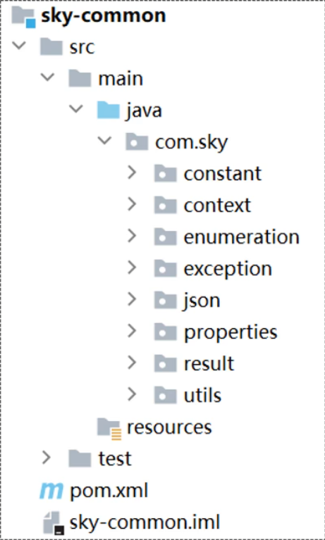

存放公共类，可以供其他模块使用

###### sky-pojo 模块目录结构：

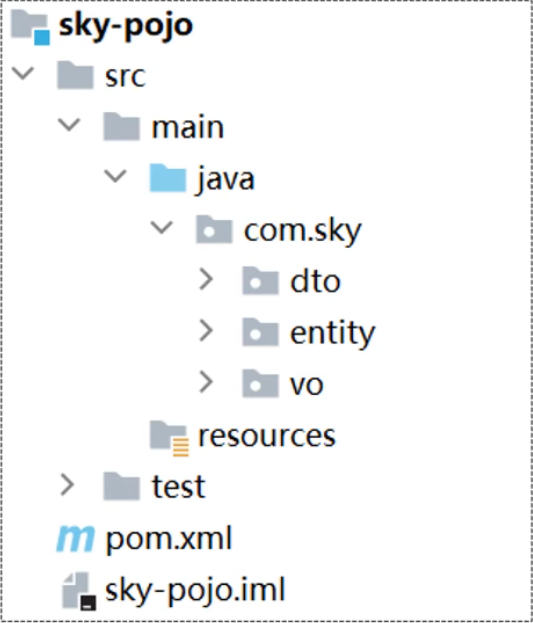

存放 entity、DTO、VO

- 名词解释：

  | 名称   | 说明                                              |
  | ------ | ------------------------------------------------- |
  | Entity | 实体，通常和数据库中的表对应                      |
  | DTO    | 数据传输对象，通常用于程序中各层之间传递数据      |
  | VO     | 视图对象，为前端展示数据提供的对象                |
  | POJO   | 普通 Java 对象，只有属性和对应的 getter 和 setter |

###### sky-server 模块目录结构：

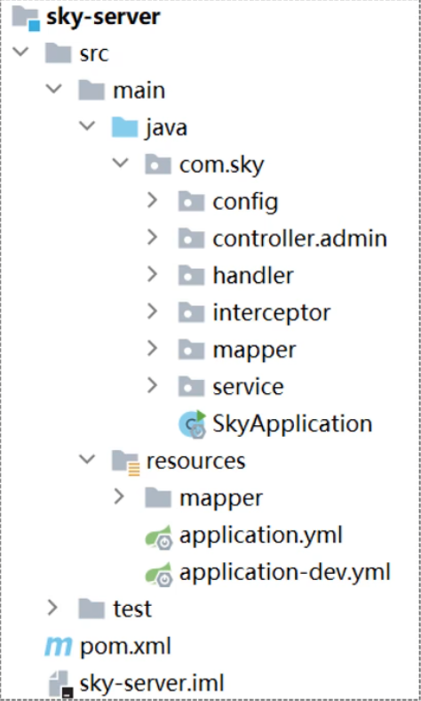

存放配置文件、配置类、拦截器、controller、service、mapper、启动类等

###### 使用 Git 进行版本控制

1. 创建本地仓库
2. 提交本地仓库
3. 推送到远程仓库

###### 数据库环境搭建

执行提供的 sql 脚本

###### 前后端联调

> **nginx 反向代理：**
>
> nginx 反向代理，就是将前端发送的动态请求由 nginx 转发到后端服务器
>
> 
>
> nginx 反向代理的好处：
>
> - 提高访问速度
>
> - 进行负载均衡
>
>   > 所谓负载均衡，就是把大量的请求按照我们指定的方式均衡地分配给集群中的每台服务器
>
> - 保证后端服务安全（外界无法直接访问后端服务，不对外开放，只能由公司内网请求）
>
> **反向代理配置方式：**
>
> ```nginx
> server {
> 	listen 80;
> 	server_name localhost;
> 	
> 	location /api/ { # 当请求路径中含有/api/时，将/api/前面的部分改为http://localhost:8080/admin/，后面的部分拼在其后
> 		proxy_pass http://localhost:8080/admin/; # 反向代理
> 	}
> }
> ```
>
> **负载均衡配置方式：**
>
> ```nginx
> upstream webservers { # 服务器集群每台服务器ip
>     server 192.168.100.128:8080;
>     server 192.168.100.129:8080;
> }
> 
> server {
>     listen 80;
>     server_name localhost;
>     
>     location /api/ { # 具体转发给哪台主机，哪台主机转发多，哪台转发少，由负载均衡策略决定
>         proxy_pass http://webservers/admin/; # 负载均衡
>     }
> }
> ```
>
> **负载均衡策略：**
>
> | 名称       | 说明                                                       |
> | ---------- | ---------------------------------------------------------- |
> | 轮询       | 默认方式                                                   |
> | weight     | 权重方式，默认为1，权重越高，被分配的客户端请求就越多      |
> | ip_hash    | 根据 ip 分配方式，这样每个访客可以固定访问一个后端服务     |
> | least_conn | 依据最少连接方式，把请求优先分配给连接数少的后端服务       |
> | url_hash   | 根据 url 分配方式，这样相同的 url 会被分配到同一个后端服务 |
> | fair       | 依据响应时间方式，响应时间短的服务将会被优先分配           |

##### 完善登录功能

问题：员工表中的密码是明文存储，安全性太低

思路：

1. 将密码加密后存储，提高安全性

2. 使用 MD5 加密方式对明文密码加密

   > MD5（Message Digest Algorithm 5）是一种哈希函数，而不是加密算法。哈希函数是一种将任意长度的输入数据映射为固定长度散列值的算法。MD5 产生的散列值通常是128位长，通常以32个十六进制字符的形式表示。
   >
   > MD5 算法的特点是快速且具有固定输出长度。然而，由于其设计上的一些弱点，MD5 已经被认为不安全，不建议在安全性要求较高的场景中使用。在现代加密和安全标准中，通常推荐使用更安全的哈希函数，如SHA-256（Secure Hash Algorithm 256-bit）等。

3. 验证时将明文加密为密文，再与数据库中已有密码比较

步骤：

1. 修改数据库中明文密码，改为 MD5 加密后的密文

2. 修改 Java 代码，前端提交的密码进行 MD5 加密后再跟数据库中密码比对

   > Spring 框架提供了对字符串进行 MD5 加密的工具类，使用如下：
   >
   > ```java
   > password = DigestUtils.md5DigestAsHex(password.getBytes());
   > if (!password.equals(employee.getPassword())) {
   >     throw new PassWordErrorException(MessageConstant.PASSWORD_ERROR);
   > }
   > ```
   >
   > 

#### 导入接口文档

##### 前后端分离开发流程

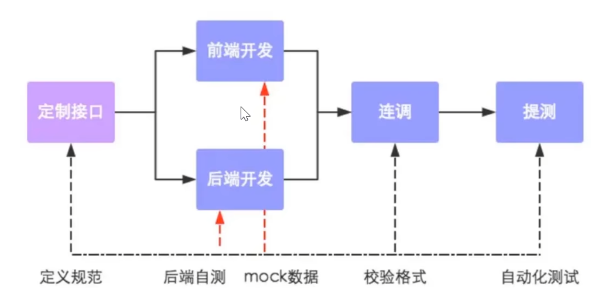

##### 操作步骤

将资料中提供的项目接口导入 YApi

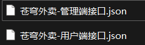

管理端共47个接口，用户端共25个接口

#### Swagger

##### 介绍

使用 Swagger，你只需要按照它的规范去定义接口及接口相关的信息，就可以做到生成接口文档，以及**在线接口调试**页面。

官网：[http://swagger.io](Swagger 官网)

**Knife4j** 是为 Java MVC 框架集成 Swagger 生成 Api 文档的增强解决方案

```xml
<dependency>
	<groupId>com.github.xiaoymin</groupId>
    <artifactId>knife4j-spring-boot-starter</artifactId>
    <version>3.0.2</version>
</dependency>
```

##### 使用方式

1. 导入 knife4j 的 maven 坐标
2. 在配置类中加入 knife4j 相关配置
3. 设置静态资源映射，否则接口文档页面无法访问

> Swagger 和 YApi
>
> - YApi 是设计阶段使用的工具，用于管理和维护接口
> - Swagger 是开发阶段使用的框架，帮助后端开发人员做后端的接口测试
> - YApi 和 Swagger 的侧重点不同，不能说谁替代了谁，在项目开发中两者都是必要的

##### 常用注解

`@Api`：对 controller 类的说明

`@ApiModel`：对 pojo 类的说明

`@ApiModelProperty` ：对 pojo 类的属性的说明

`@ApiOperation`：对方法用途、作用等的说明

### 员工管理

#### 新增员工

##### 需求分析

- 分析传递参数限制

- 设计接口

  > 为方便后端区分，管理端发出的请求，统一使用 /admin 作为前缀，用户端发出的请求，统一使用 /user 作为前缀

- 查看对应数据库，来明晰数据约束

##### 代码开发

根据新增员工接口设计对应的 DTO

> 注意：当前端提交的数据和实体类中对应的属性差别比较大时，建议使用 DTO 来封装数据

```java
@Data
public class EmployeeDTO implements Serializable {

    private Long id;

    private String username;

    private String name;

    private String phone;

    private String sex;

    private String idNumber;

}
```

##### 功能测试

##### 代码完善

- 录入的用户名已存在，抛出异常后没有处理

  用全局异常处理类来捕获相应异常，并返回给前端异常信息。

- 新增员工时，创建人 ID 和修改人 ID 设置为了固定值

  1. 从请求头中拿到 token，读取出 token 中的员工 id
  2. 第一步操作是在 JwtTokenAdminInterceptor 类中完成的，如何将拿到的员工 id 传给 service 层的 save 方法？
  3. 使用 ThreadLocal 类，由于客户端的一次请求会在同一个线程中进行，所以我们可以先把员工 id 存到 ThreadLocal 类中，然后在之后需要的时候再取出来用

  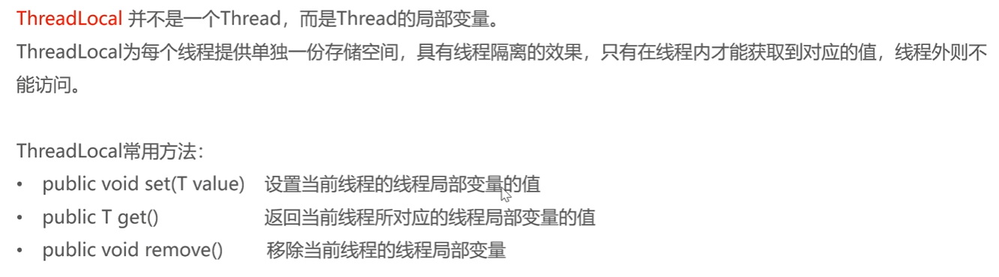

#### 员工分页查询

使用 EmployeePageQueryDTO 接收前端参数，返回 Result<PageResult> 对象，泛型中含有查询的总条数和该页的员工列表。

问题：查询返回的日期格式不符合预期

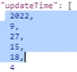

解决方法：

- 在属性上加入注解，对日期进行格式化

  ```java
  @JsonFormat(pattern = "yyyy-MM-dd HH:mm:ss")
  private LocalDateTime createTime;
  ```

- 在 WebMvcConfiguration 中扩展 Spring MVC 的消息转换器，统一对日期类型进行格式化处理

  ```java
  @Override
  protected void extendMessageConverters(List<HttpMessageConverter<?>> converters) {
      // 创建一个消息转换器对象
      MappingJackson2HttpMessageConverter converter = new MappingJackson2HttpMessageConverter();
      // 需要为消息转换器设置一个对象转换器，对象转换器可以将Java对象序列化为json对象
      converter.setObjectMapper(new JacksonObjectMapper());
      // 将自己的消息转换器加入到容器中，并设置优先级为0（第一）
      converters.add(0, converter);
  }
  ```

#### 启用禁用员工账号

无新增技术

#### 编辑员工

 无新增技术

### 分类管理

#### 导入分类模块功能代码

### 菜品管理

#### 公共字段自动填充

**问题：**每次增加菜品、分类等都要填充创建时间、修改时间、创建人id和修改人id，代码冗余

**解决思路：**

1. 明确操作时机

   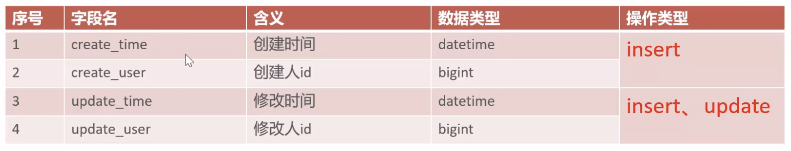

2. 使用 AOP 来为公共字段填充值，具体做法是：

   1. 自定义注解 AutoFill，用于表示需要进行公共字段自动填充的方法
   2. 自定义切面类 AutoFillAspect，统一拦截加入了 AutoFill 注解的方法，通过反射为公共字段赋值
   3. 在对应方法上加入注解

技术点：枚举、注解、AOP、反射

**代码实现：**


#### 新增菜品

#### 菜品分页查询

#### 删除菜品

#### 修改菜品

### 套餐管理实战

## 点餐业务模块

### 店铺营业状态设置

### 微信登陆

### 缓存商品

### 购物车

### 用户下单

### 订单支付和管理

### 历史订单

### 订单状态定时处理

### 来单提醒和客户催单

## 统计报表模块

### 图形报表设计

### Excel 报表统计

