# 苍穹外卖

## 基础数据模块

### 项目概述

#### 软件开发整体介绍

##### 软件开发流程（从上至下）

1. 需求分析：需求规格说明书、产品原型
2. 设计：UI设计、数据库设计、接口设计
3. 编码：项目代码、单元测试
4. 测试：测试用例、测试报告
5. 上线运维：软件环境安装、配置

##### 角色分工

- 项目经理：对整个项目负责，**任务分配、把控进度**
- 产品经理：进行**需求调研**，输出需求调研文档、产品原型等
- UI设计师：根据产品原型输出**界面效果图**
- 架构师：项目整体**架构设计、技术选型**等
- 开发工程师：代码实现
- 测试工程师：编写测试用例、输出测试报告
- 运维工程师：软件环境搭建、项目上线

##### 软件环境

- 开发环境（development）：开发人员在开发阶段使用的环境，一般外部用户无法访问
- 测试环境（tesing）：专门给测试人员使用的环境，用于测试项目，一般外部用户无法访问
- 生产环境（production）：即线上环境，正式提供对外服务的环境

#### 苍穹外卖项目介绍

##### 项目介绍

**定位：**专门为餐饮企业（餐厅、饭店）定制的一款软件产品

功能架构：体现项目中的业务功能模块


##### 产品原型

**用于展示项目的业务功能，一般由产品经理进行设计**

一般为一组 HTML 网页，内含页面原型和需求介绍以及设计要求

##### 技术选型

**展示项目中使用到的技术框架和中间件等**


###### 用户层（主要是前端技术）：

- Node.js
- Vue.js
- ElementUI
- 微信小程序
- Apache Echarts

###### 网关层：Nginx

###### 应用层（主要是后端技术）：

- Spring Boot
- Spring MVC
- Spring Task（订单计时）
- HttpClient（发送 HTTP 请求）
- Spring Cache（缓存框架）
- JWT
- 阿里云OSS
- Swagger
- POI（操作 Excel 表格）
- WebSocket（实现催单，来单提醒。一种网络协议）

###### 数据层：

- MySQL
- Redis（数据库缓存中间件）
- MyBatis
- PageHelper
- Spring Data Redis（简化操作 Redis 的一组 API）

###### 工具：

- Git
- JUnit
- Maven
- Postman

### 环境搭建

#### 开发环境搭建

##### 前端环境搭建

###### 整体结构


- 双击前端环境 `Nginx` 文件夹中的 `nginx.exe` 启动 nginx 服务，访问端口号为 `80`

- 前端项目已经部署到了 `Nginx` 文件夹中，通过 `localhost:80` 即可访问到前端项目

##### 后端环境搭建

后端工程基于 **Maven** 进行项目构建，并且进行**分模块**开发

###### 项目结构：


###### 项目各模块说明：

| 名称         | 说明                                                         |
| ------------ | ------------------------------------------------------------ |
| sky-take-out | Maven 父工程，统一管理依赖版本，聚合其他子模块               |
| sky-common   | 子模块，存放公共类，例如：工具类、常量类、异常类等           |
| sky-pojo     | 子模块，存放实体类、VO、DTO 等                               |
| sky-server   | 子模块，后端服务，存放配置文件、Controller、Service、Mapper 等 |

###### sky-common 模块目录结构：


存放公共类，可以供其他模块使用

###### sky-pojo 模块目录结构：


存放 entity、DTO、VO

- 名词解释：

  | 名称   | 说明                                              |
  | ------ | ------------------------------------------------- |
  | Entity | 实体，通常和数据库中的表对应                      |
  | DTO    | 数据传输对象，通常用于程序中各层之间传递数据      |
  | VO     | 视图对象，为前端展示数据提供的对象                |
  | POJO   | 普通 Java 对象，只有属性和对应的 getter 和 setter |

###### sky-server 模块目录结构：


存放配置文件、配置类、拦截器、controller、service、mapper、启动类等

###### 使用 Git 进行版本控制

1. 创建本地仓库
2. 提交本地仓库
3. 推送到远程仓库

###### 数据库环境搭建

执行提供的 sql 脚本

###### 前后端联调

> **nginx 反向代理：**
>
> nginx 反向代理，就是将前端发送的动态请求由 nginx 转发到后端服务器
>
> 
>
> nginx 反向代理的好处：
>
> - 提高访问速度
>
> - 进行负载均衡
>
>   > 所谓负载均衡，就是把大量的请求按照我们指定的方式均衡地分配给集群中的每台服务器
>
> - 保证后端服务安全（外界无法直接访问后端服务，不对外开放，只能由公司内网请求）
>
> **反向代理配置方式：**
>
> ```nginx
> server {
> 	listen 80;
> 	server_name localhost;
> 	
> 	location /api/ { # 当请求路径中含有/api/时，将/api/前面的部分改为http://localhost:8080/admin/，后面的部分拼在其后
> 		proxy_pass http://localhost:8080/admin/; # 反向代理
> 	}
> }
> ```
>
> **负载均衡配置方式：**
>
> ```nginx
> upstream webservers { # 服务器集群每台服务器ip
>     server 192.168.100.128:8080;
>     server 192.168.100.129:8080;
> }
> 
> server {
>     listen 80;
>     server_name localhost;
>     
>     location /api/ { # 具体转发给哪台主机，哪台主机转发多，哪台转发少，由负载均衡策略决定
>         proxy_pass http://webservers/admin/; # 负载均衡
>     }
> }
> ```
>
> **负载均衡策略：**
>
> | 名称       | 说明                                                       |
> | ---------- | ---------------------------------------------------------- |
> | 轮询       | 默认方式                                                   |
> | weight     | 权重方式，默认为1，权重越高，被分配的客户端请求就越多      |
> | ip_hash    | 根据 ip 分配方式，这样每个访客可以固定访问一个后端服务     |
> | least_conn | 依据最少连接方式，把请求优先分配给连接数少的后端服务       |
> | url_hash   | 根据 url 分配方式，这样相同的 url 会被分配到同一个后端服务 |
> | fair       | 依据响应时间方式，响应时间短的服务将会被优先分配           |

##### 完善登录功能

问题：员工表中的密码是明文存储，安全性太低

思路：

1. 将密码加密后存储，提高安全性

2. 使用 MD5 加密方式对明文密码加密

   > MD5（Message Digest Algorithm 5）是一种哈希函数，而不是加密算法。哈希函数是一种将任意长度的输入数据映射为固定长度散列值的算法。MD5 产生的散列值通常是128位长，通常以32个十六进制字符的形式表示。
   >
   > MD5 算法的特点是快速且具有固定输出长度。然而，由于其设计上的一些弱点，MD5 已经被认为不安全，不建议在安全性要求较高的场景中使用。在现代加密和安全标准中，通常推荐使用更安全的哈希函数，如SHA-256（Secure Hash Algorithm 256-bit）等。

3. 验证时将明文加密为密文，再与数据库中已有密码比较

步骤：

1. 修改数据库中明文密码，改为 MD5 加密后的密文

2. 修改 Java 代码，前端提交的密码进行 MD5 加密后再跟数据库中密码比对

   > Spring 框架提供了对字符串进行 MD5 加密的工具类，使用如下：
   >
   > ```java
   > password = DigestUtils.md5DigestAsHex(password.getBytes());
   > if (!password.equals(employee.getPassword())) {
   >     throw new PassWordErrorException(MessageConstant.PASSWORD_ERROR);
   > }
   > ```
   >
   > 

#### 导入接口文档

##### 前后端分离开发流程


##### 操作步骤

将资料中提供的项目接口导入 YApi


管理端共47个接口，用户端共25个接口

#### Swagger

##### 介绍

使用 Swagger，你只需要按照它的规范去定义接口及接口相关的信息，就可以做到生成接口文档，以及**在线接口调试**页面。

官网：[http://swagger.io](Swagger 官网)

**Knife4j** 是为 Java MVC 框架集成 Swagger 生成 Api 文档的增强解决方案

```xml
<dependency>
	<groupId>com.github.xiaoymin</groupId>
    <artifactId>knife4j-spring-boot-starter</artifactId>
    <version>3.0.2</version>
</dependency>
```

##### 使用方式

1. 导入 knife4j 的 maven 坐标
2. 在配置类中加入 knife4j 相关配置
3. 设置静态资源映射，否则接口文档页面无法访问

> Swagger 和 YApi
>
> - YApi 是设计阶段使用的工具，用于管理和维护接口
> - Swagger 是开发阶段使用的框架，帮助后端开发人员做后端的接口测试
> - YApi 和 Swagger 的侧重点不同，不能说谁替代了谁，在项目开发中两者都是必要的

##### 常用注解

`@Api`：对 controller 类的说明

`@ApiModel`：对 pojo 类的说明

`@ApiModelProperty` ：对 pojo 类的属性的说明

`@ApiOperation`：对方法用途、作用等的说明

### 员工管理

#### 新增员工

##### 需求分析

- 分析传递参数限制

- 设计接口

  > 为方便后端区分，管理端发出的请求，统一使用 /admin 作为前缀，用户端发出的请求，统一使用 /user 作为前缀

- 查看对应数据库，来明晰数据约束

##### 代码开发

根据新增员工接口设计对应的 DTO

> 注意：当前端提交的数据和实体类中对应的属性差别比较大时，建议使用 DTO 来封装数据

```java
@Data
public class EmployeeDTO implements Serializable {

    private Long id;

    private String username;

    private String name;

    private String phone;

    private String sex;

    private String idNumber;

}
```

##### 功能测试

##### 代码完善

- 录入的用户名已存在，抛出异常后没有处理

  用全局异常处理类来捕获相应异常，并返回给前端异常信息。

- 新增员工时，创建人 ID 和修改人 ID 设置为了固定值

  1. 从请求头中拿到 token，读取出 token 中的员工 id
  2. 第一步操作是在 JwtTokenAdminInterceptor 类中完成的，如何将拿到的员工 id 传给 service 层的 save 方法？
  3. 使用 ThreadLocal 类，由于客户端的一次请求会在同一个线程中进行，所以我们可以先把员工 id 存到 ThreadLocal 类中，然后在之后需要的时候再取出来用

  

#### 员工分页查询

使用 EmployeePageQueryDTO 接收前端参数，返回 Result<PageResult> 对象，泛型中含有查询的总条数和该页的员工列表。

问题：查询返回的日期格式不符合预期


解决方法：

- 在属性上加入注解，对日期进行格式化

  ```java
  @JsonFormat(pattern = "yyyy-MM-dd HH:mm:ss")
  private LocalDateTime createTime;
  ```

- 在 WebMvcConfiguration 中扩展 Spring MVC 的消息转换器，统一对日期类型进行格式化处理

  ```java
  @Override
  protected void extendMessageConverters(List<HttpMessageConverter<?>> converters) {
      // 创建一个消息转换器对象
      MappingJackson2HttpMessageConverter converter = new MappingJackson2HttpMessageConverter();
      // 需要为消息转换器设置一个对象转换器，对象转换器可以将Java对象序列化为json对象
      converter.setObjectMapper(new JacksonObjectMapper());
      // 将自己的消息转换器加入到容器中，并设置优先级为0（第一）
      converters.add(0, converter);
  }
  ```

#### 启用禁用员工账号

无新增技术

#### 编辑员工

 无新增技术

### 分类管理

#### 导入分类模块功能代码

### 菜品管理

#### 公共字段自动填充

**问题：**每次增加菜品、分类等都要填充创建时间、修改时间、创建人id和修改人id，代码冗余

**解决思路：**

1. 明确操作时机

   

2. 使用 AOP 来为公共字段填充值，具体做法是：

   1. 自定义注解 AutoFill，用于表示需要进行公共字段自动填充的方法
   2. 自定义切面类 AutoFillAspect，统一拦截加入了 AutoFill 注解的方法，通过反射为公共字段赋值
   3. 在对应方法上加入注解

技术点：枚举、注解、AOP、反射

**代码实现：**

```java
@Component
@Aspect
@Slf4j
public class AutoFillAspect {
    @Pointcut("execution(* com.sky.service.*.*(..))")
    public void servicePointCut() {}

    @Pointcut("execution(* com.sky.mapper.*.*(..))")
    public void mapperPointCut() {}

    @Pointcut("(servicePointCut() || mapperPointCut()) && @annotation(com.sky.annotation.AutoFill)")
    public void autoFillAspect() {}
    
    @Before("autoFillAspect()")
    public void autoFill(JoinPoint joinPoint) throws NoSuchMethodException, InvocationTargetException, IllegalAccessException {
        // 日志记录
        log.info("进行公共字段自动填充");
        // 拿到操作类型
        MethodSignature signature = (MethodSignature) joinPoint.getSignature();
        AutoFill annotation = (AutoFill) signature.getMethod().getAnnotation(AutoFill.class);
        OperationType type = annotation.value();
        // 拿到方法参数
        Object entity = joinPoint.getArgs()[0];
        // 数据准备
        LocalDateTime now = LocalDateTime.now();
        Long id = BaseContext.getCurrentId();
        // 通过反射来设置值
        if (type == OperationType.INSERT) {
            Method setCreateTime = entity.getClass().getMethod(AutoFillConstant.SET_CREATE_TIME, LocalDateTime.class);
            Method setUpdateTime = entity.getClass().getMethod(AutoFillConstant.SET_UPDATE_TIME, LocalDateTime.class);
            Method setCreateUser = entity.getClass().getMethod(AutoFillConstant.SET_CREATE_USER, Long.class);
            Method setUpdateUser = entity.getClass().getMethod(AutoFillConstant.SET_UPDATE_USER, Long.class);

            setCreateTime.invoke(entity, now);
            setUpdateTime.invoke(entity, now);
            setCreateUser.invoke(entity, id);
            setUpdateUser.invoke(entity, id);
        } else if (type == OperationType.UPDATE) {
            Method setUpdateTime = entity.getClass().getMethod(AutoFillConstant.SET_UPDATE_TIME, LocalDateTime.class);
            Method setUpdateUser = entity.getClass().getMethod(AutoFillConstant.SET_UPDATE_USER, Long.class);

            setUpdateTime.invoke(entity, now);
            setUpdateUser.invoke(entity, id);
        }
    }
}
```

#### 新增菜品

1. 使用 DTO 接收前端传参
2. 公共字段自动填充
3. 完成新增菜品
4. 拿到返回的新增菜品的id
5. 新增口味

#### 菜品分页查询

#### 删除菜品

业务规则：

- 可以一次删除一个菜品，也可以批量删除菜品
- 起售中的菜品不能删除
- 被套餐关联的菜品不能删除
- 删除菜品后，关联的口味数据也需要删除掉

**重要**

前端请求路径为 `..?ids=1,2,3`

我们如果想要用 List 来接收这些 id，就需要在参数前面加上注解 `@RequestParam`，这样，springMVC 会帮我们把形如 `1,2,3` 的数据格式以列表的方式封装到我们的 List 中 

#### 修改菜品

先修改菜品信息，再统一删除关联口味信息，最后添加上修改后的口味信息

### 套餐管理实战

#### 新增套餐

分析需求：

- 套餐状态默认为停售
- 一个套餐可以对应多个菜品
- 一个菜品可以对应多个套餐
- 新增后要维护 setmeal_dish 表
- categoryId 即为套餐所属分类的 id

#### 分页查询套餐

分析需求：

- 用 SetmealVO 来包装数据
- 返回 PageResult 对象
- 根据 categoryId 查出分类名，使用多表查询
- 分类被禁用后，前台不展示

**使用别名进行多表查询时，select 后面跟的字段名也一定要起与实体类对应的别名，否则查询结果无法映射到实体类的属性上**

#### 删除套餐

分析需求：

- 批量删除，使用 ids 接收前端传参，用 @RequestParam 让 SpringMVC 自动封装到 List 中
- 起售的套餐不能删除
- 能够删除的套餐，关联的菜品也要一并删除
- 包含起售的套餐，则最后抛异常，并不予删除

#### 修改套餐

分析需求：

- 实现根据 id 查询用于页面回显
- 用 setmealDTO 接收前端传参
- 自动填充公共字段
- 先统一删除关联菜品再添加修改后的菜品

#### 起售停售套餐

分析需求：

- 套餐内有停售菜品，则套餐无法起售

### Redis

#### Redis 入门

##### Redis 简介

Redis 是一个基于内存的 key-value 结构数据库

- 基于内存存储，读写性能高
- 适合存储热点数据（热点商品、咨询、新闻，在某一时间段会被用户大量访问的数据）
- 企业应用广泛

官网：https://redis.io

中文网：https://www.redis.net.cn/

##### Redis 下载与安装

Windows 版本下的 Redis 目录结构

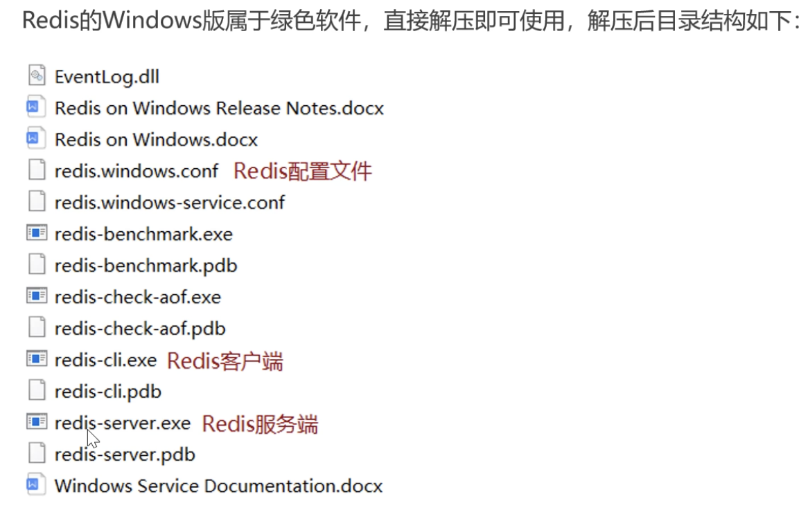

##### Redis 服务启动与停止

服务启动：`redis-server`

服务停止：`ctrl+c or command+c`

客户端登录：`redis-cli -h ipaddress -p port`

客户端退出：`exit`

Redis 默认登录没有密码，为提高安全性，在配置文件中配置登录密码

```
// 找到这一行配置项
requirepass yourPassword
```

**Redis 中没有用户这一概念**

#### Redis 数据类型

##### 5 种常用数据类型介绍

Redis 使用键值对 key-value 结构来存储数据，其中 key 规定是字符串类型，而 value 有 5 种常用类型：

- 字符串 string
- 哈希 hash （适合存储对象）
- 列表 list
- 集合 set
- 有序集合 sorted set / zet

##### 各种数据类型的特点

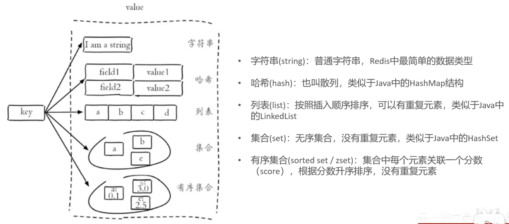

#### Redis 常用命令

==Redis 命令不区分大小写==

##### 字符串操作命令

| 命令                      | 意义                                                      |
| ------------------------- | --------------------------------------------------------- |
| `SET key value`           | 设置指定 key 的value                                      |
| `GET key`                 | 获取指定 key 的 value                                     |
| `SETEX key seconds value` | 设置指定 key 的value， 并将 key 的过期时间设为 seconds 秒 |
| `SETNX key value`         | 只有当 key 不存在时设置 key 的value（防覆盖）             |

##### 哈希操作命令

Redis hash 是一个 string 类型的 field 和 value 的映射表，hash 特别适合用于存储对象，常用命令：

| 命令                   | 意义                                             |
| ---------------------- | ------------------------------------------------ |
| `HSET key field value` | 将名为 key 的哈希表中的字段 field 的值设为 value |
| `HSET key field`       | 获取存储在哈希表 key 中的指定 field 的 value     |
| `HDEL key field`       | 删除存储在哈希表 key 中的指定 field              |
| `HKEYS key`            | 获取哈希表中所有 field                           |
| `HVALS key`            | 获取哈希表中所有 value                           |

哈希表的 key-value 的形象图示

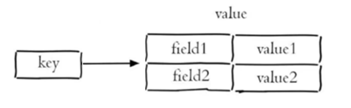

##### 列表操作命令

 Redis 列表是简单的**字符串**列表，按照插入顺序排序，常用命令：

| 命令                        | 意义                                                |
| --------------------------- | --------------------------------------------------- |
| `LPUSH key value1 [value2]` | 将一个或多个值插入到列表头部                        |
| `LRANGE key start stop`     | 获取列表指定范围内的元素（0 表示开头，-1 表示结尾） |
| `RPOP key`                  | 移除并获取列表最后一个元素                          |
| `LLEN key`                  | 获取列表长度                                        |

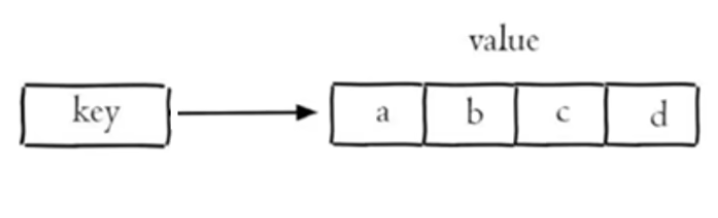

##### 集合操作命令

Redis set 是 string 类型的无序集合。集合成员是唯一的，集合中不能出现重复的数据，常用命令：

| 命令                         | 意义                               |
| ---------------------------- | ---------------------------------- |
| `SADD key member1 [member2]` | 向集合 key 中添加一个或多个 member |
| `SMEMBERS key`               | 返回集合 key 中的所有 member       |
| `SCARD key`                  | 获取集合 key 中的 member 数量      |
| `SINTER key1 [key2]`         | 返回集合 key1 [key2] 等的交集      |
| `SUNION key1 [key2]`         | 返回集合 key1 [key2] 等的并集      |
| `SREM key member1 [member2]` | 删除集合 key 中的一个或多个 member |

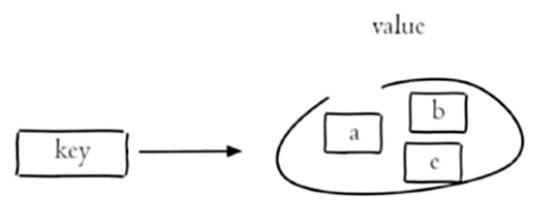

##### 有序集合操作命令

Redis 有序集合是 string 类型元素的集合，且不允许有重复成员。每个元素都会关联一个 double 类型的分数。常用命令：

| 命令                                       | 意义                                                         |
| ------------------------------------------ | ------------------------------------------------------------ |
| `ZADD key score1 member1 [score2 member2]` | 向有序集合 key 中添加一个或多个带 score 的 member            |
| `ZRANGE key start stop [WITHSCORES]`       | 通过索引区间返回有序集合 key 中指定区间内的 member （及其 score）（分数升序） |
| `ZINCRBY key increment member`             | 对有序集合 key 中对指定 member 成员的 score 加上增量 increment |
| `ZREM key member [member...]`              | 删除有序集合 key 中的一个或多个 member                       |

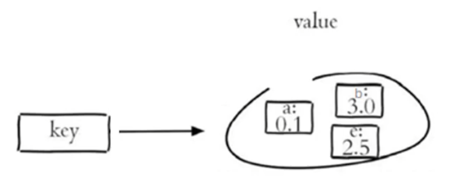

##### 通用命令

Redis 的通用命令是不区分数据类型的，都可以使用的命令：

| 命令           | 意义                                                     |
| -------------- | -------------------------------------------------------- |
| `KEYS pattern` | 查找所有符合给定 pattern 的 key（支持通配符）            |
| `EXISTS key`   | 检查给定的 key 是否存在                                  |
| `TYPE key`     | 返回 key 所储存的值的类型                                |
| `DEL key`      | 当 key 存在时将 key 删除，可一次删除多个，用空格隔开 key |

#### 在 Java 中操作 Redis

##### Redis 的 Java 客户端

Redis 的 Java 客户端很多，常用的有以下几种：

- Jedis（Redis 官方推荐）
- Lettuce（性能高效）
- Spring Data Redis

Spring Data Redis 是 Spring 的一部分，对 Redis 底层开发包（包括 Jedis 和 Lettuce） 进行了高度封装。

在 Spring 项目中，可以使用 Spring Data Redis 来简化操作

##### Spring Data Redis 使用方式

###### 步骤：

1. 导入 Spring Data Redis 的 maven 坐标

   ```xml
   <dependency>
       <groupId>org.springframework.boot</groupId>
       <artifactId>spring-boot-starter-data-redis</artifactId>
   </dependency>
   ```

2. 配置 Redis 数据源

   ```yaml
   spring:
     redis:
       host: localhost
       port: 6379
       password: ...re
   ```

3. 编写配置类，创建 RedisTemplate 对象

   ```java
   @Configuration
   @Slf4j
   public class RedisConfiguration {
   
       @Bean
       public RedisTemplate redisTemplate(RedisConnectionFactory redisConnectionFactory) {
           log.info("开始创建RedisTemplate对象");
           RedisTemplate redisTemplate = new RedisTemplate();
           // 设置连接工厂
           redisTemplate.setConnectionFactory(redisConnectionFactory);
           // 设置序列化器
           redisTemplate.setDefaultSerializer(new StringRedisSerializer());
   
           return redisTemplate;
       }
   }
   ```

4. 通过 RedisTemplate 对象操作 Redis

   该对象提供了操作五种数据类型的对象

   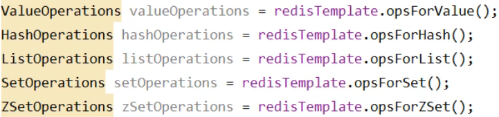

###### 字符串操作

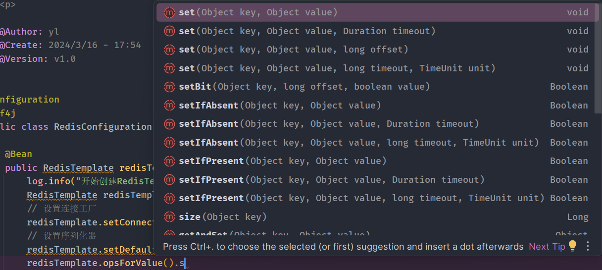

set 中的多个重载方法就对应了 set setex，setIfAbsent 对应了 setnx，get 对应了 get

###### 哈希操作

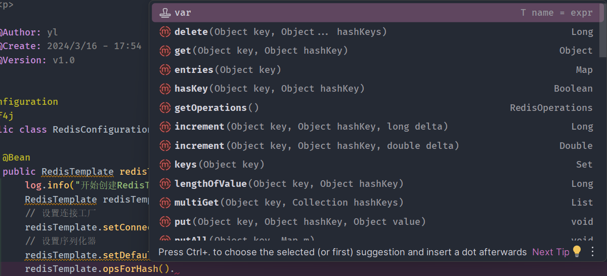

hset 对应 put，hget 对应 get，hdel 对应 delete，hkeys 对应 keys，hvals 对应 values

###### 列表操作

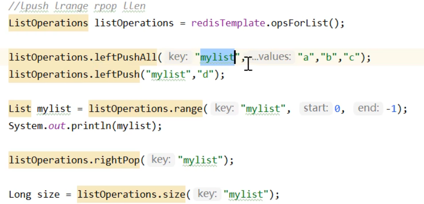

###### 集合操作

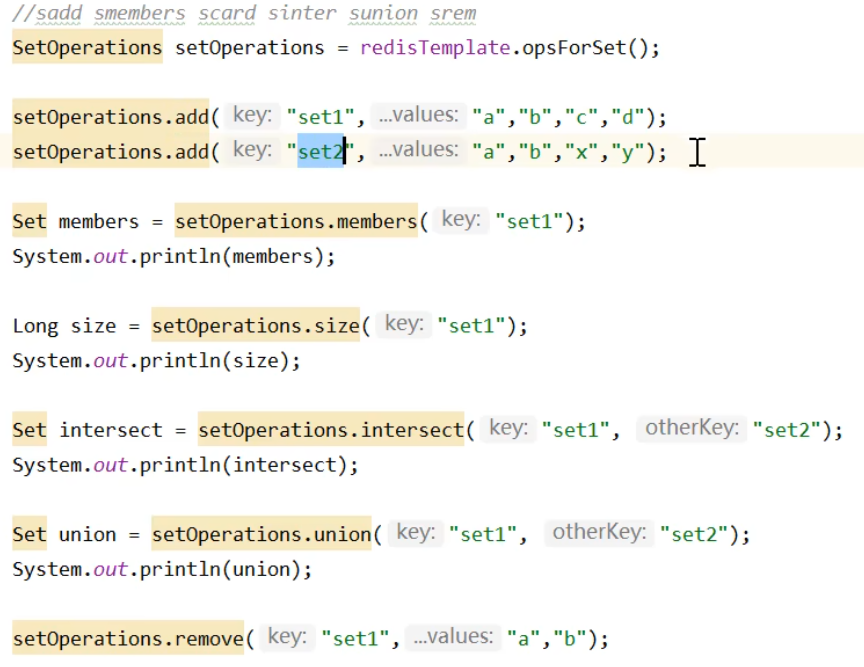

###### 有序集合

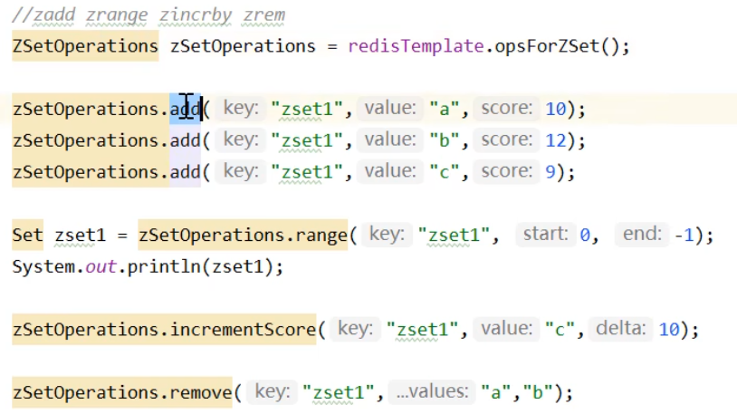

###### 通用命令

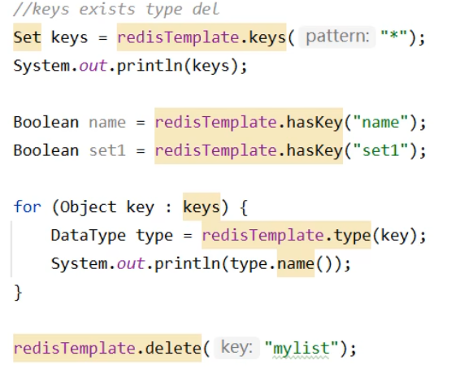

## 点餐业务模块

### 店铺营业状态设置

#### 需求分析和设计

接口设计：

- 设置营业状态
- 管理端查询营业状态
- 用户端查询营业状态

项目约定（设置两个查询接口的原因）：

- 管理端发出的请求，统一使用 /admin 作为前缀
- 用户端发出的请求，统一使用 /user 作为前缀

营业状态数据存储方式：基于 Redis 的字符串来进行存储

#### 代码开发

```java
@RestController("adminShopController")
@Slf4j
@RequestMapping("/admin/shop")
@RequiredArgsConstructor(onConstructor_ = {@Autowired})
public class ShopController {

    private final ShopService shopService;

    @PutMapping("/{status}")
    public Result updateStatus(@PathVariable Integer status) {
        // 日志记录
        log.info("将店铺的营业状态设置为：{}", status);
        // 调用service完成状态更新
        shopService.updateStatus(status.toString());

        return Result.success();
    }

    @GetMapping("/status")
    public Result<Integer> getStatus() {
        // 日志记录
        log.info("管理端获取店铺状态");
        // 调用service获取状态
        Integer status = shopService.getStatus();

        return Result.success(status);
    }
}
```

```java
@RestController("userShopController")
@RequestMapping("/user/shop")
@Slf4j
@RequiredArgsConstructor(onConstructor_ = {@Autowired})
public class ShopController {

    private final ShopService shopService;

    @GetMapping("/status")
    public Result<Integer> getStatus() {
        // 日志记录
        log.info("用户端获取店铺状态");
        // 调用service获取状态
        Integer status = shopService.getStatus();

        return Result.success(status);
    }
}
```

```java
@Service
@Slf4j
@RequiredArgsConstructor(onConstructor_ = {@Autowired})
public class ShopServiceImpl implements ShopService {

    private final RedisTemplate redisTemplate;

    @Override
    public void updateStatus(String status) {
        redisTemplate.opsForValue().set(StatusConstant.SHOP_STATUS, status);
    }

    @Override
    public Integer getStatus() {
        return Integer.parseInt(redisTemplate.opsForValue().get(StatusConstant.SHOP_STATUS).toString());
    }
}
```

#### 功能测试

### 微信登录

#### HttpClient

##### 介绍

HttpClient 是 Apache Jakarta Common 下的子项目，可以用来提供高效的、最新的、功能丰富的支持 HTTP 协议的**客户端编程工具包**，并且它支持 HTTP 协议最新的版本和建议。

Maven 坐标

```xml
<dependency>
    <groupId>org.apache.httpcomponents</groupId>
    <artifactId>httpclient</artifactId>
    <version>4.5.13</version>
</dependency>
```

核心 API

- HttpClient
- HttpClients
- CloseableHttpClient
- HttpGet
- HttpPost

发送请求步骤：

- 创建 HttpClient 对象
- 创建 Http 请求对象
- 调用 HttpClient 的 execute 方法发送请求

##### 入门案例

###### GET 请求

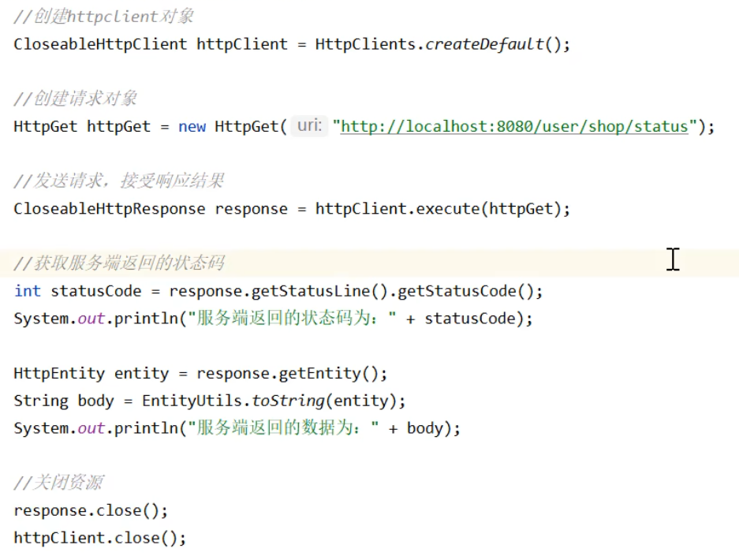

###### POST 请求

 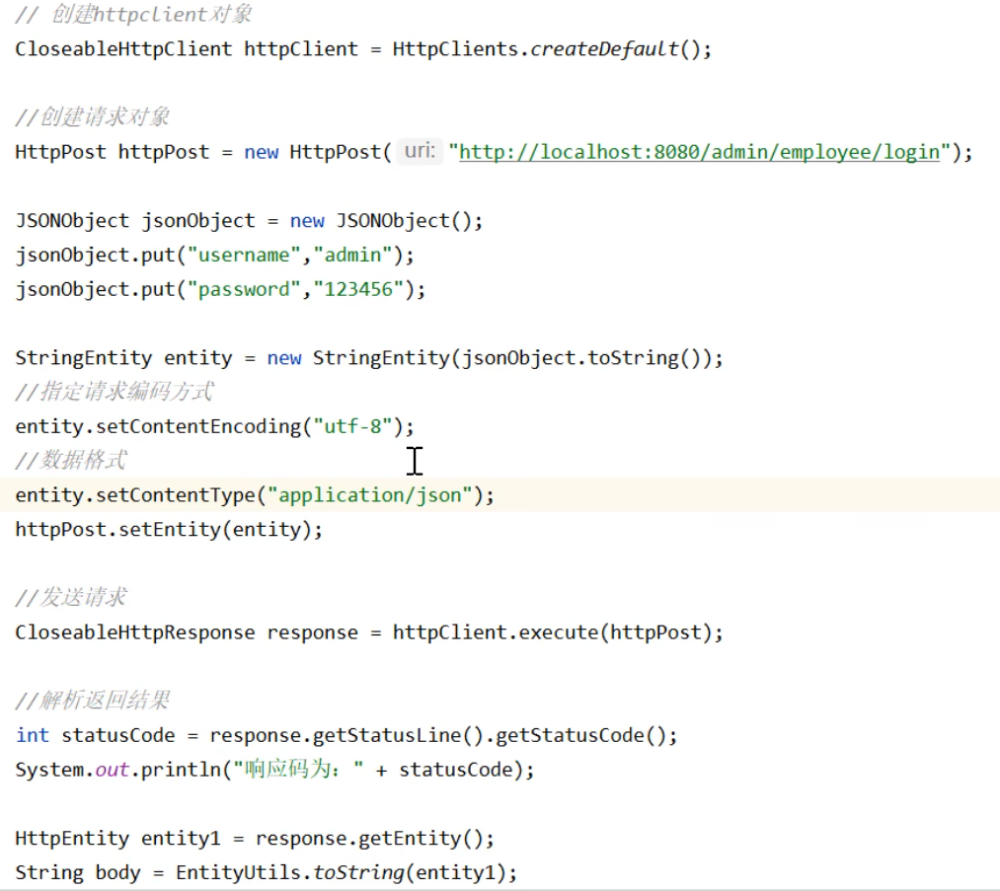

记得关闭资源

###### 代码中提供的工具类

```java
public class HttpClientUtil {

    static final  int TIMEOUT_MSEC = 5 * 1000;

    /**
     * 发送GET方式请求
     * @param url
     * @param paramMap
     * @return
     */
    public static String doGet(String url,Map<String,String> paramMap){
        // 创建Httpclient对象
        CloseableHttpClient httpClient = HttpClients.createDefault();

        String result = "";
        CloseableHttpResponse response = null;

        try{
            URIBuilder builder = new URIBuilder(url);
            if(paramMap != null){
                for (String key : paramMap.keySet()) {
                    builder.addParameter(key,paramMap.get(key));
                }
            }
            URI uri = builder.build();

            //创建GET请求
            HttpGet httpGet = new HttpGet(uri);

            //发送请求
            response = httpClient.execute(httpGet);

            //判断响应状态
            if(response.getStatusLine().getStatusCode() == 200){
                result = EntityUtils.toString(response.getEntity(),"UTF-8");
            }
        }catch (Exception e){
            e.printStackTrace();
        }finally {
            try {
                response.close();
                httpClient.close();
            } catch (IOException e) {
                e.printStackTrace();
            }
        }

        return result;
    }

    /**
     * 发送POST方式请求
     * @param url
     * @param paramMap
     * @return
     * @throws IOException
     */
    public static String doPost(String url, Map<String, String> paramMap) throws IOException {
        // 创建Httpclient对象
        CloseableHttpClient httpClient = HttpClients.createDefault();
        CloseableHttpResponse response = null;
        String resultString = "";

        try {
            // 创建Http Post请求
            HttpPost httpPost = new HttpPost(url);

            // 创建参数列表
            if (paramMap != null) {
                List<NameValuePair> paramList = new ArrayList();
                for (Map.Entry<String, String> param : paramMap.entrySet()) {
                    paramList.add(new BasicNameValuePair(param.getKey(), param.getValue()));
                }
                // 模拟表单
                UrlEncodedFormEntity entity = new UrlEncodedFormEntity(paramList);
                httpPost.setEntity(entity);
            }

            httpPost.setConfig(builderRequestConfig());

            // 执行http请求
            response = httpClient.execute(httpPost);

            resultString = EntityUtils.toString(response.getEntity(), "UTF-8");
        } catch (Exception e) {
            throw e;
        } finally {
            try {
                response.close();
            } catch (IOException e) {
                e.printStackTrace();
            }
        }

        return resultString;
    }

    /**
     * 发送POST方式请求
     * @param url
     * @param paramMap
     * @return
     * @throws IOException
     */
    public static String doPost4Json(String url, Map<String, String> paramMap) throws IOException {
        // 创建Httpclient对象
        CloseableHttpClient httpClient = HttpClients.createDefault();
        CloseableHttpResponse response = null;
        String resultString = "";

        try {
            // 创建Http Post请求
            HttpPost httpPost = new HttpPost(url);

            if (paramMap != null) {
                //构造json格式数据
                JSONObject jsonObject = new JSONObject();
                for (Map.Entry<String, String> param : paramMap.entrySet()) {
                    jsonObject.put(param.getKey(),param.getValue());
                }
                StringEntity entity = new StringEntity(jsonObject.toString(),"utf-8");
                //设置请求编码
                entity.setContentEncoding("utf-8");
                //设置数据类型
                entity.setContentType("application/json");
                httpPost.setEntity(entity);
            }

            httpPost.setConfig(builderRequestConfig());

            // 执行http请求
            response = httpClient.execute(httpPost);

            resultString = EntityUtils.toString(response.getEntity(), "UTF-8");
        } catch (Exception e) {
            throw e;
        } finally {
            try {
                response.close();
            } catch (IOException e) {
                e.printStackTrace();
            }
        }

        return resultString;
    }
    private static RequestConfig builderRequestConfig() {
        return RequestConfig.custom()
                .setConnectTimeout(TIMEOUT_MSEC)
                .setConnectionRequestTimeout(TIMEOUT_MSEC)
                .setSocketTimeout(TIMEOUT_MSEC).build();
    }

}
```

#### 微信小程序开发

##### 介绍

微信小程序，一种新的开放能力，可以在微信内被便捷地获取和传播，同时具有出色的使用体验。

官方介绍：[公众号 (qq.com)](https://mp.weixin.qq.com/cgi-bin/wx)

接入流程：


开放注册范围：

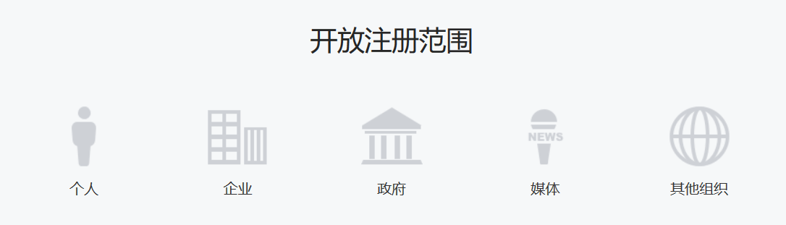

不同的注册范围享有不同的权限，个人注册范围无法接入微信支付功能

##### 准备工作

开发微信小程序之前需要做如下准备工作：

- 注册小程序
- 完善小程序信息
- 下载开发者工具

##### 入门案例

步骤

- 了解小程序目录结构
- 编写小程序代码
- 编译小程序

###### 目录结构

小程序包含一个描述整体程序的 app 和多个描述各自页面的 page。

一个小程序的主体部分由三个文件组成，必须放在项目的根目录，如下：

| 文件     | 必需 | 作用             |
| -------- | ---- | ---------------- |
| app.js   | 是   | 小程序逻辑       |
| app.json | 是   | 小程序公共配置   |
| app.wxss | 否   | 小程序公共样式表 |

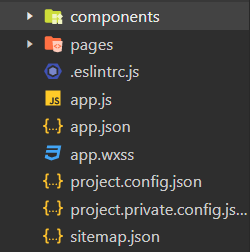

一个小程序的页面由四个文件组成：

| 文件类型 | 必需 | 作用       |
| -------- | ---- | ---------- |
| js       | 是   | 页面逻辑   |
| wxml     | 是   | 页面结构   |
| json     | 否   | 页面配置   |
| wxss     | 否   | 页面样式表 |

###### 导入小程序代码

#### 微信登录

##### 微信登录流程

帮助文档：[开放能力 / 用户信息 / 小程序登录 (qq.com)](https://developers.weixin.qq.com/miniprogram/dev/framework/open-ability/login.html)


##### 需求分析与设计

##### 代码开发

```java
@Override
    public UserLoginVO login(UserLoginDTO userLoginDTO) {
        // 通过前端code获得用户的openid（微信用户唯一标识）
        String openid = getOpenid(userLoginDTO.getCode());
        // 验证openid是否为空，为空则传递参数code有误，登录失败
        if (openid == null) {
            throw new LoginFailedException(MessageConstant.LOGIN_FAILED);
        }
        // 获取数据库中的该user信息
        User user = userMapper.getByOpenId(openid);
        // 如果user为空，则该用户为新用户，为其注册
        if (user == null) {
            user = User.builder().openid(openid).createTime(LocalDateTime.now()).build();
            save(user);
        }
        // 生成jwt令牌
        Map<String, Object> claims = new HashMap<>();
        claims.put(JwtClaimsConstant.USER_ID, user.getId());
        String token = JwtUtil.createJWT(jwtProperties.getUserSecretKey(), jwtProperties.getUserTtl(), claims);
        // 返回UserLoginVO对象
        return UserLoginVO.builder().id(user.getId()).openid(user.getOpenid()).token(token).build();
    }

    private String getOpenid(String code) {
        // 通过前端code获得用户的openid（微信用户唯一标识）
        HashMap<String, String> params = new HashMap<>();
        params.put("appid", weChatProperties.getAppid());
        params.put("secret", weChatProperties.getSecret());
        params.put("js_code", code);
        params.put("grant_type", "authorization_code");
        String response = HttpClientUtil.doGet(LOGIN_URL, params);

        JSONObject jsonObject = JSON.parseObject(response);
        return jsonObject.getString("openid");
    }
```

##### 功能测试

#### 导入商品浏览功能模块

##### 需求分析与设计

###### 接口设计

- 查询分类
- 根据分类 id 查询菜品（关联口味数据）
- 根据分类 id 查询套餐
- 根据套餐 id 查询包含的菜品


### 缓存商品

### 购物车

### 用户下单

### 订单支付和管理

### 历史订单

### 订单状态定时处理

### 来单提醒和客户催单

## 统计报表模块

### 图形报表设计

### Excel 报表统计

