# 苍穹外卖

## 基础数据模块

### 项目概述

#### 软件开发整体介绍

##### 软件开发流程（从上至下）

1. 需求分析：需求规格说明书、产品原型
2. 设计：UI设计、数据库设计、接口设计
3. 编码：项目代码、单元测试
4. 测试：测试用例、测试报告
5. 上线运维：软件环境安装、配置

##### 角色分工

- 项目经理：对整个项目负责，**任务分配、把控进度**
- 产品经理：进行**需求调研**，输出需求调研文档、产品原型等
- UI设计师：根据产品原型输出**界面效果图**
- 架构师：项目整体**架构设计、技术选型**等
- 开发工程师：代码实现
- 测试工程师：编写测试用例、输出测试报告
- 运维工程师：软件环境搭建、项目上线

##### 软件环境

- 开发环境（development）：开发人员在开发阶段使用的环境，一般外部用户无法访问
- 测试环境（tesing）：专门给测试人员使用的环境，用于测试项目，一般外部用户无法访问
- 生产环境（production）：即线上环境，正式提供对外服务的环境

#### 苍穹外卖项目介绍

##### 项目介绍

**定位：**专门为餐饮企业（餐厅、饭店）定制的一款软件产品

功能架构：体现项目中的业务功能模块


##### 产品原型

**用于展示项目的业务功能，一般由产品经理进行设计**

一般为一组 HTML 网页，内含页面原型和需求介绍以及设计要求

##### 技术选型

**展示项目中使用到的技术框架和中间件等**


###### 用户层（主要是前端技术）：

- Node.js
- Vue.js
- ElementUI
- 微信小程序
- Apache Echarts

###### 网关层：Nginx

###### 应用层（主要是后端技术）：

- Spring Boot
- Spring MVC
- Spring Task（订单计时）
- HttpClient（发送 HTTP 请求）
- Spring Cache（缓存框架）
- JWT
- 阿里云OSS
- Swagger
- POI（操作 Excel 表格）
- WebSocket（实现催单，来单提醒。一种网络协议）

###### 数据层：

- MySQL
- Redis（数据库缓存中间件）
- MyBatis
- PageHelper
- Spring Data Redis（简化操作 Redis 的一组 API）

###### 工具：

- Git
- JUnit
- Maven
- Postman

### 环境搭建

#### 开发环境搭建

##### 前端环境搭建

###### 整体结构


- 双击前端环境 `Nginx` 文件夹中的 `nginx.exe` 启动 nginx 服务，访问端口号为 `80`

- 前端项目已经部署到了 `Nginx` 文件夹中，通过 `localhost:80` 即可访问到前端项目

##### 后端环境搭建

后端工程基于 **Maven** 进行项目构建，并且进行**分模块**开发

###### 项目结构：


###### 项目各模块说明：

| 名称         | 说明                                                         |
| ------------ | ------------------------------------------------------------ |
| sky-take-out | Maven 父工程，统一管理依赖版本，聚合其他子模块               |
| sky-common   | 子模块，存放公共类，例如：工具类、常量类、异常类等           |
| sky-pojo     | 子模块，存放实体类、VO、DTO 等                               |
| sky-server   | 子模块，后端服务，存放配置文件、Controller、Service、Mapper 等 |

###### sky-common 模块目录结构：


存放公共类，可以供其他模块使用

###### sky-pojo 模块目录结构：


存放 entity、DTO、VO

- 名词解释：

  | 名称   | 说明                                              |
  | ------ | ------------------------------------------------- |
  | Entity | 实体，通常和数据库中的表对应                      |
  | DTO    | 数据传输对象，通常用于程序中各层之间传递数据      |
  | VO     | 视图对象，为前端展示数据提供的对象                |
  | POJO   | 普通 Java 对象，只有属性和对应的 getter 和 setter |

###### sky-server 模块目录结构：


存放配置文件、配置类、拦截器、controller、service、mapper、启动类等

###### 使用 Git 进行版本控制

1. 创建本地仓库
2. 提交本地仓库
3. 推送到远程仓库

###### 数据库环境搭建

执行提供的 sql 脚本

###### 前后端联调

> **nginx 反向代理：**
>
> nginx 反向代理，就是将前端发送的动态请求由 nginx 转发到后端服务器
>
> 
>
> nginx 反向代理的好处：
>
> - 提高访问速度
>
> - 进行负载均衡
>
>   > 所谓负载均衡，就是把大量的请求按照我们指定的方式均衡地分配给集群中的每台服务器
>
> - 保证后端服务安全（外界无法直接访问后端服务，不对外开放，只能由公司内网请求）
>
> **反向代理配置方式：**
>
> ```nginx
> server {
> 	listen 80;
> 	server_name localhost;
> 	
> 	location /api/ { # 当请求路径中含有/api/时，将/api/前面的部分改为http://localhost:8080/admin/，后面的部分拼在其后
> 		proxy_pass http://localhost:8080/admin/; # 反向代理
> 	}
> }
> ```
>
> **负载均衡配置方式：**
>
> ```nginx
> upstream webservers { # 服务器集群每台服务器ip
>     server 192.168.100.128:8080;
>     server 192.168.100.129:8080;
> }
> 
> server {
>     listen 80;
>     server_name localhost;
>     
>     location /api/ { # 具体转发给哪台主机，哪台主机转发多，哪台转发少，由负载均衡策略决定
>         proxy_pass http://webservers/admin/; # 负载均衡
>     }
> }
> ```
>
> **负载均衡策略：**
>
> | 名称       | 说明                                                       |
> | ---------- | ---------------------------------------------------------- |
> | 轮询       | 默认方式                                                   |
> | weight     | 权重方式，默认为1，权重越高，被分配的客户端请求就越多      |
> | ip_hash    | 根据 ip 分配方式，这样每个访客可以固定访问一个后端服务     |
> | least_conn | 依据最少连接方式，把请求优先分配给连接数少的后端服务       |
> | url_hash   | 根据 url 分配方式，这样相同的 url 会被分配到同一个后端服务 |
> | fair       | 依据响应时间方式，响应时间短的服务将会被优先分配           |

##### 完善登录功能

问题：员工表中的密码是明文存储，安全性太低

思路：

1. 将密码加密后存储，提高安全性

2. 使用 MD5 加密方式对明文密码加密

   > MD5（Message Digest Algorithm 5）是一种哈希函数，而不是加密算法。哈希函数是一种将任意长度的输入数据映射为固定长度散列值的算法。MD5 产生的散列值通常是128位长，通常以32个十六进制字符的形式表示。
   >
   > MD5 算法的特点是快速且具有固定输出长度。然而，由于其设计上的一些弱点，MD5 已经被认为不安全，不建议在安全性要求较高的场景中使用。在现代加密和安全标准中，通常推荐使用更安全的哈希函数，如SHA-256（Secure Hash Algorithm 256-bit）等。

3. 验证时将明文加密为密文，再与数据库中已有密码比较

步骤：

1. 修改数据库中明文密码，改为 MD5 加密后的密文

2. 修改 Java 代码，前端提交的密码进行 MD5 加密后再跟数据库中密码比对

   > Spring 框架提供了对字符串进行 MD5 加密的工具类，使用如下：
   >
   > ```java
   > password = DigestUtils.md5DigestAsHex(password.getBytes());
   > if (!password.equals(employee.getPassword())) {
   >     throw new PassWordErrorException(MessageConstant.PASSWORD_ERROR);
   > }
   > ```
   >
   > 

#### 导入接口文档

##### 前后端分离开发流程


##### 操作步骤

将资料中提供的项目接口导入 YApi


管理端共47个接口，用户端共25个接口

#### Swagger

##### 介绍

使用 Swagger，你只需要按照它的规范去定义接口及接口相关的信息，就可以做到生成接口文档，以及**在线接口调试**页面。

官网：[http://swagger.io](Swagger 官网)

**Knife4j** 是为 Java MVC 框架集成 Swagger 生成 Api 文档的增强解决方案

```xml
<dependency>
	<groupId>com.github.xiaoymin</groupId>
    <artifactId>knife4j-spring-boot-starter</artifactId>
    <version>3.0.2</version>
</dependency>
```

##### 使用方式

1. 导入 knife4j 的 maven 坐标
2. 在配置类中加入 knife4j 相关配置
3. 设置静态资源映射，否则接口文档页面无法访问

> Swagger 和 YApi
>
> - YApi 是设计阶段使用的工具，用于管理和维护接口
> - Swagger 是开发阶段使用的框架，帮助后端开发人员做后端的接口测试
> - YApi 和 Swagger 的侧重点不同，不能说谁替代了谁，在项目开发中两者都是必要的

##### 常用注解

`@Api`：对 controller 类的说明

`@ApiModel`：对 pojo 类的说明

`@ApiModelProperty` ：对 pojo 类的属性的说明

`@ApiOperation`：对方法用途、作用等的说明

### 员工管理

#### 新增员工

##### 需求分析

- 分析传递参数限制

- 设计接口

  > 为方便后端区分，管理端发出的请求，统一使用 /admin 作为前缀，用户端发出的请求，统一使用 /user 作为前缀

- 查看对应数据库，来明晰数据约束

##### 代码开发

根据新增员工接口设计对应的 DTO

> 注意：当前端提交的数据和实体类中对应的属性差别比较大时，建议使用 DTO 来封装数据

```java
@Data
public class EmployeeDTO implements Serializable {

    private Long id;

    private String username;

    private String name;

    private String phone;

    private String sex;

    private String idNumber;

}
```

##### 功能测试

##### 代码完善

- 录入的用户名已存在，抛出异常后没有处理

  用全局异常处理类来捕获相应异常，并返回给前端异常信息。

- 新增员工时，创建人 ID 和修改人 ID 设置为了固定值

  1. 从请求头中拿到 token，读取出 token 中的员工 id
  2. 第一步操作是在 JwtTokenAdminInterceptor 类中完成的，如何将拿到的员工 id 传给 service 层的 save 方法？
  3. 使用 ThreadLocal 类，由于客户端的一次请求会在同一个线程中进行，所以我们可以先把员工 id 存到 ThreadLocal 类中，然后在之后需要的时候再取出来用

  

#### 员工分页查询

使用 EmployeePageQueryDTO 接收前端参数，返回 Result<PageResult> 对象，泛型中含有查询的总条数和该页的员工列表。

问题：查询返回的日期格式不符合预期


解决方法：

- 在属性上加入注解，对日期进行格式化

  ```java
  @JsonFormat(pattern = "yyyy-MM-dd HH:mm:ss")
  private LocalDateTime createTime;
  ```

- 在 WebMvcConfiguration 中扩展 Spring MVC 的消息转换器，统一对日期类型进行格式化处理

  ```java
  @Override
  protected void extendMessageConverters(List<HttpMessageConverter<?>> converters) {
      // 创建一个消息转换器对象
      MappingJackson2HttpMessageConverter converter = new MappingJackson2HttpMessageConverter();
      // 需要为消息转换器设置一个对象转换器，对象转换器可以将Java对象序列化为json对象
      converter.setObjectMapper(new JacksonObjectMapper());
      // 将自己的消息转换器加入到容器中，并设置优先级为0（第一）
      converters.add(0, converter);
  }
  ```

#### 启用禁用员工账号

无新增技术

#### 编辑员工

 无新增技术

### 分类管理

#### 导入分类模块功能代码

### 菜品管理

#### 公共字段自动填充

**问题：**每次增加菜品、分类等都要填充创建时间、修改时间、创建人id和修改人id，代码冗余

**解决思路：**

1. 明确操作时机

   

2. 使用 AOP 来为公共字段填充值，具体做法是：

   1. 自定义注解 AutoFill，用于表示需要进行公共字段自动填充的方法
   2. 自定义切面类 AutoFillAspect，统一拦截加入了 AutoFill 注解的方法，通过反射为公共字段赋值
   3. 在对应方法上加入注解

技术点：枚举、注解、AOP、反射

**代码实现：**

```java
@Component
@Aspect
@Slf4j
public class AutoFillAspect {
    @Pointcut("execution(* com.sky.service.*.*(..))")
    public void servicePointCut() {}

    @Pointcut("execution(* com.sky.mapper.*.*(..))")
    public void mapperPointCut() {}

    @Pointcut("(servicePointCut() || mapperPointCut()) && @annotation(com.sky.annotation.AutoFill)")
    public void autoFillAspect() {}
    
    @Before("autoFillAspect()")
    public void autoFill(JoinPoint joinPoint) throws NoSuchMethodException, InvocationTargetException, IllegalAccessException {
        // 日志记录
        log.info("进行公共字段自动填充");
        // 拿到操作类型
        MethodSignature signature = (MethodSignature) joinPoint.getSignature();
        AutoFill annotation = (AutoFill) signature.getMethod().getAnnotation(AutoFill.class);
        OperationType type = annotation.value();
        // 拿到方法参数
        Object entity = joinPoint.getArgs()[0];
        // 数据准备
        LocalDateTime now = LocalDateTime.now();
        Long id = BaseContext.getCurrentId();
        // 通过反射来设置值
        if (type == OperationType.INSERT) {
            Method setCreateTime = entity.getClass().getMethod(AutoFillConstant.SET_CREATE_TIME, LocalDateTime.class);
            Method setUpdateTime = entity.getClass().getMethod(AutoFillConstant.SET_UPDATE_TIME, LocalDateTime.class);
            Method setCreateUser = entity.getClass().getMethod(AutoFillConstant.SET_CREATE_USER, Long.class);
            Method setUpdateUser = entity.getClass().getMethod(AutoFillConstant.SET_UPDATE_USER, Long.class);

            setCreateTime.invoke(entity, now);
            setUpdateTime.invoke(entity, now);
            setCreateUser.invoke(entity, id);
            setUpdateUser.invoke(entity, id);
        } else if (type == OperationType.UPDATE) {
            Method setUpdateTime = entity.getClass().getMethod(AutoFillConstant.SET_UPDATE_TIME, LocalDateTime.class);
            Method setUpdateUser = entity.getClass().getMethod(AutoFillConstant.SET_UPDATE_USER, Long.class);

            setUpdateTime.invoke(entity, now);
            setUpdateUser.invoke(entity, id);
        }
    }
}
```

#### 新增菜品

1. 使用 DTO 接收前端传参
2. 公共字段自动填充
3. 完成新增菜品
4. 拿到返回的新增菜品的id
5. 新增口味

#### 菜品分页查询

#### 删除菜品

业务规则：

- 可以一次删除一个菜品，也可以批量删除菜品
- 起售中的菜品不能删除
- 被套餐关联的菜品不能删除
- 删除菜品后，关联的口味数据也需要删除掉

**重要**

前端请求路径为 `..?ids=1,2,3`

我们如果想要用 List 来接收这些 id，就需要在参数前面加上注解 `@RequestParam`，这样，springMVC 会帮我们把形如 `1,2,3` 的数据格式以列表的方式封装到我们的 List 中 

#### 修改菜品

先修改菜品信息，再统一删除关联口味信息，最后添加上修改后的口味信息

### 套餐管理实战

#### 新增套餐

分析需求：

- 套餐状态默认为停售
- 一个套餐可以对应多个菜品
- 一个菜品可以对应多个套餐
- 新增后要维护 setmeal_dish 表
- categoryId 即为套餐所属分类的 id

#### 分页查询套餐

分析需求：

- 用 SetmealVO 来包装数据
- 返回 PageResult 对象
- 根据 categoryId 查出分类名，使用多表查询
- 分类被禁用后，前台不展示

**使用别名进行多表查询时，select 后面跟的字段名也一定要起与实体类对应的别名，否则查询结果无法映射到实体类的属性上**

#### 删除套餐

分析需求：

- 批量删除，使用 ids 接收前端传参，用 @RequestParam 让 SpringMVC 自动封装到 List 中
- 起售的套餐不能删除
- 能够删除的套餐，关联的菜品也要一并删除
- 包含起售的套餐，则最后抛异常，并不予删除

#### 修改套餐

分析需求：

- 实现根据 id 查询用于页面回显
- 用 setmealDTO 接收前端传参
- 自动填充公共字段
- 先统一删除关联菜品再添加修改后的菜品

#### 起售停售套餐

分析需求：

- 套餐内有停售菜品，则套餐无法起售

### Redis

#### Redis 入门

##### Redis 简介

Redis 是一个基于内存的 key-value 结构数据库

- 基于内存存储，读写性能高
- 适合存储热点数据（热点商品、咨询、新闻，在某一时间段会被用户大量访问的数据）
- 企业应用广泛

官网：https://redis.io

中文网：https://www.redis.net.cn/

##### Redis 下载与安装

Windows 版本下的 Redis 目录结构


##### Redis 服务启动与停止

服务启动：`redis-server`

服务停止：`ctrl+c or command+c`

客户端登录：`redis-cli -h ipaddress -p port`

客户端退出：`exit`

Redis 默认登录没有密码，为提高安全性，在配置文件中配置登录密码

```
// 找到这一行配置项
requirepass yourPassword
```

**Redis 中没有用户这一概念**

#### Redis 数据类型

##### 5 种常用数据类型介绍

Redis 使用键值对 key-value 结构来存储数据，其中 key 规定是字符串类型，而 value 有 5 种常用类型：

- 字符串 string
- 哈希 hash （适合存储对象）
- 列表 list
- 集合 set
- 有序集合 sorted set / zet

##### 各种数据类型的特点


#### Redis 常用命令

==Redis 命令不区分大小写==

##### 字符串操作命令

| 命令                      | 意义                                                      |
| ------------------------- | --------------------------------------------------------- |
| `SET key value`           | 设置指定 key 的value                                      |
| `GET key`                 | 获取指定 key 的 value                                     |
| `SETEX key seconds value` | 设置指定 key 的value， 并将 key 的过期时间设为 seconds 秒 |
| `SETNX key value`         | 只有当 key 不存在时设置 key 的value（防覆盖）             |

##### 哈希操作命令

Redis hash 是一个 string 类型的 field 和 value 的映射表，hash 特别适合用于存储对象，常用命令：

| 命令                   | 意义                                             |
| ---------------------- | ------------------------------------------------ |
| `HSET key field value` | 将名为 key 的哈希表中的字段 field 的值设为 value |
| `HSET key field`       | 获取存储在哈希表 key 中的指定 field 的 value     |
| `HDEL key field`       | 删除存储在哈希表 key 中的指定 field              |
| `HKEYS key`            | 获取哈希表中所有 field                           |
| `HVALS key`            | 获取哈希表中所有 value                           |

哈希表的 key-value 的形象图示


##### 列表操作命令

 Redis 列表是简单的**字符串**列表，按照插入顺序排序，常用命令：

| 命令                        | 意义                                                |
| --------------------------- | --------------------------------------------------- |
| `LPUSH key value1 [value2]` | 将一个或多个值插入到列表头部                        |
| `LRANGE key start stop`     | 获取列表指定范围内的元素（0 表示开头，-1 表示结尾） |
| `RPOP key`                  | 移除并获取列表最后一个元素                          |
| `LLEN key`                  | 获取列表长度                                        |


##### 集合操作命令

Redis set 是 string 类型的无序集合。集合成员是唯一的，集合中不能出现重复的数据，常用命令：

| 命令                         | 意义                               |
| ---------------------------- | ---------------------------------- |
| `SADD key member1 [member2]` | 向集合 key 中添加一个或多个 member |
| `SMEMBERS key`               | 返回集合 key 中的所有 member       |
| `SCARD key`                  | 获取集合 key 中的 member 数量      |
| `SINTER key1 [key2]`         | 返回集合 key1 [key2] 等的交集      |
| `SUNION key1 [key2]`         | 返回集合 key1 [key2] 等的并集      |
| `SREM key member1 [member2]` | 删除集合 key 中的一个或多个 member |


##### 有序集合操作命令

Redis 有序集合是 string 类型元素的集合，且不允许有重复成员。每个元素都会关联一个 double 类型的分数。常用命令：

| 命令                                       | 意义                                                         |
| ------------------------------------------ | ------------------------------------------------------------ |
| `ZADD key score1 member1 [score2 member2]` | 向有序集合 key 中添加一个或多个带 score 的 member            |
| `ZRANGE key start stop [WITHSCORES]`       | 通过索引区间返回有序集合 key 中指定区间内的 member （及其 score）（分数升序） |
| `ZINCRBY key increment member`             | 对有序集合 key 中对指定 member 成员的 score 加上增量 increment |
| `ZREM key member [member...]`              | 删除有序集合 key 中的一个或多个 member                       |


##### 通用命令

Redis 的通用命令是不区分数据类型的，都可以使用的命令：

| 命令           | 意义                                                     |
| -------------- | -------------------------------------------------------- |
| `KEYS pattern` | 查找所有符合给定 pattern 的 key（支持通配符）            |
| `EXISTS key`   | 检查给定的 key 是否存在                                  |
| `TYPE key`     | 返回 key 所储存的值的类型                                |
| `DEL key`      | 当 key 存在时将 key 删除，可一次删除多个，用空格隔开 key |

#### 在 Java 中操作 Redis

##### Redis 的 Java 客户端

Redis 的 Java 客户端很多，常用的有以下几种：

- Jedis（Redis 官方推荐）
- Lettuce（性能高效）
- Spring Data Redis

Spring Data Redis 是 Spring 的一部分，对 Redis 底层开发包（包括 Jedis 和 Lettuce） 进行了高度封装。

在 Spring 项目中，可以使用 Spring Data Redis 来简化操作

##### Spring Data Redis 使用方式

###### 步骤：

1. 导入 Spring Data Redis 的 maven 坐标

   ```xml
   <dependency>
       <groupId>org.springframework.boot</groupId>
       <artifactId>spring-boot-starter-data-redis</artifactId>
   </dependency>
   ```

2. 配置 Redis 数据源

   ```yaml
   spring:
     redis:
       host: localhost
       port: 6379
       password: ...re
   ```

3. 编写配置类，创建 RedisTemplate 对象

   ```java
   @Configuration
   @Slf4j
   public class RedisConfiguration {
   
       @Bean
       public RedisTemplate redisTemplate(RedisConnectionFactory redisConnectionFactory) {
           log.info("开始创建RedisTemplate对象");
           RedisTemplate redisTemplate = new RedisTemplate();
           // 设置连接工厂
           redisTemplate.setConnectionFactory(redisConnectionFactory);
           // 设置序列化器
           redisTemplate.setDefaultSerializer(new StringRedisSerializer());
   
           return redisTemplate;
       }
   }
   ```

4. 通过 RedisTemplate 对象操作 Redis

   该对象提供了操作五种数据类型的对象

   

###### 字符串操作


set 中的多个重载方法就对应了 set setex，setIfAbsent 对应了 setnx，get 对应了 get

###### 哈希操作


hset 对应 put，hget 对应 get，hdel 对应 delete，hkeys 对应 keys，hvals 对应 values

###### 列表操作


###### 集合操作


###### 有序集合


###### 通用命令


## 点餐业务模块

### 店铺营业状态设置

#### 需求分析和设计

接口设计：

- 设置营业状态
- 管理端查询营业状态
- 用户端查询营业状态

项目约定（设置两个查询接口的原因）：

- 管理端发出的请求，统一使用 /admin 作为前缀
- 用户端发出的请求，统一使用 /user 作为前缀

营业状态数据存储方式：基于 Redis 的字符串来进行存储

#### 代码开发

```java
@RestController("adminShopController")
@Slf4j
@RequestMapping("/admin/shop")
@RequiredArgsConstructor(onConstructor_ = {@Autowired})
public class ShopController {

    private final ShopService shopService;

    @PutMapping("/{status}")
    public Result updateStatus(@PathVariable Integer status) {
        // 日志记录
        log.info("将店铺的营业状态设置为：{}", status);
        // 调用service完成状态更新
        shopService.updateStatus(status.toString());

        return Result.success();
    }

    @GetMapping("/status")
    public Result<Integer> getStatus() {
        // 日志记录
        log.info("管理端获取店铺状态");
        // 调用service获取状态
        Integer status = shopService.getStatus();

        return Result.success(status);
    }
}
```

```java
@RestController("userShopController")
@RequestMapping("/user/shop")
@Slf4j
@RequiredArgsConstructor(onConstructor_ = {@Autowired})
public class ShopController {

    private final ShopService shopService;

    @GetMapping("/status")
    public Result<Integer> getStatus() {
        // 日志记录
        log.info("用户端获取店铺状态");
        // 调用service获取状态
        Integer status = shopService.getStatus();

        return Result.success(status);
    }
}
```

```java
@Service
@Slf4j
@RequiredArgsConstructor(onConstructor_ = {@Autowired})
public class ShopServiceImpl implements ShopService {

    private final RedisTemplate redisTemplate;

    @Override
    public void updateStatus(String status) {
        redisTemplate.opsForValue().set(StatusConstant.SHOP_STATUS, status);
    }

    @Override
    public Integer getStatus() {
        return Integer.parseInt(redisTemplate.opsForValue().get(StatusConstant.SHOP_STATUS).toString());
    }
}
```

#### 功能测试

### 微信登录

#### HttpClient

##### 介绍

HttpClient 是 Apache Jakarta Common 下的子项目，可以用来提供高效的、最新的、功能丰富的支持 HTTP 协议的**客户端编程工具包**，并且它支持 HTTP 协议最新的版本和建议。

Maven 坐标

```xml
<dependency>
    <groupId>org.apache.httpcomponents</groupId>
    <artifactId>httpclient</artifactId>
    <version>4.5.13</version>
</dependency>
```

核心 API

- HttpClient
- HttpClients
- CloseableHttpClient
- HttpGet
- HttpPost

发送请求步骤：

- 创建 HttpClient 对象
- 创建 Http 请求对象
- 调用 HttpClient 的 execute 方法发送请求

##### 入门案例

###### GET 请求


###### POST 请求

 

记得关闭资源

###### 代码中提供的工具类

```java
public class HttpClientUtil {

    static final  int TIMEOUT_MSEC = 5 * 1000;

    /**
     * 发送GET方式请求
     * @param url
     * @param paramMap
     * @return
     */
    public static String doGet(String url,Map<String,String> paramMap){
        // 创建Httpclient对象
        CloseableHttpClient httpClient = HttpClients.createDefault();

        String result = "";
        CloseableHttpResponse response = null;

        try{
            URIBuilder builder = new URIBuilder(url);
            if(paramMap != null){
                for (String key : paramMap.keySet()) {
                    builder.addParameter(key,paramMap.get(key));
                }
            }
            URI uri = builder.build();

            //创建GET请求
            HttpGet httpGet = new HttpGet(uri);

            //发送请求
            response = httpClient.execute(httpGet);

            //判断响应状态
            if(response.getStatusLine().getStatusCode() == 200){
                result = EntityUtils.toString(response.getEntity(),"UTF-8");
            }
        }catch (Exception e){
            e.printStackTrace();
        }finally {
            try {
                response.close();
                httpClient.close();
            } catch (IOException e) {
                e.printStackTrace();
            }
        }

        return result;
    }

    /**
     * 发送POST方式请求
     * @param url
     * @param paramMap
     * @return
     * @throws IOException
     */
    public static String doPost(String url, Map<String, String> paramMap) throws IOException {
        // 创建Httpclient对象
        CloseableHttpClient httpClient = HttpClients.createDefault();
        CloseableHttpResponse response = null;
        String resultString = "";

        try {
            // 创建Http Post请求
            HttpPost httpPost = new HttpPost(url);

            // 创建参数列表
            if (paramMap != null) {
                List<NameValuePair> paramList = new ArrayList();
                for (Map.Entry<String, String> param : paramMap.entrySet()) {
                    paramList.add(new BasicNameValuePair(param.getKey(), param.getValue()));
                }
                // 模拟表单
                UrlEncodedFormEntity entity = new UrlEncodedFormEntity(paramList);
                httpPost.setEntity(entity);
            }

            httpPost.setConfig(builderRequestConfig());

            // 执行http请求
            response = httpClient.execute(httpPost);

            resultString = EntityUtils.toString(response.getEntity(), "UTF-8");
        } catch (Exception e) {
            throw e;
        } finally {
            try {
                response.close();
            } catch (IOException e) {
                e.printStackTrace();
            }
        }

        return resultString;
    }

    /**
     * 发送POST方式请求
     * @param url
     * @param paramMap
     * @return
     * @throws IOException
     */
    public static String doPost4Json(String url, Map<String, String> paramMap) throws IOException {
        // 创建Httpclient对象
        CloseableHttpClient httpClient = HttpClients.createDefault();
        CloseableHttpResponse response = null;
        String resultString = "";

        try {
            // 创建Http Post请求
            HttpPost httpPost = new HttpPost(url);

            if (paramMap != null) {
                //构造json格式数据
                JSONObject jsonObject = new JSONObject();
                for (Map.Entry<String, String> param : paramMap.entrySet()) {
                    jsonObject.put(param.getKey(),param.getValue());
                }
                StringEntity entity = new StringEntity(jsonObject.toString(),"utf-8");
                //设置请求编码
                entity.setContentEncoding("utf-8");
                //设置数据类型
                entity.setContentType("application/json");
                httpPost.setEntity(entity);
            }

            httpPost.setConfig(builderRequestConfig());

            // 执行http请求
            response = httpClient.execute(httpPost);

            resultString = EntityUtils.toString(response.getEntity(), "UTF-8");
        } catch (Exception e) {
            throw e;
        } finally {
            try {
                response.close();
            } catch (IOException e) {
                e.printStackTrace();
            }
        }

        return resultString;
    }
    private static RequestConfig builderRequestConfig() {
        return RequestConfig.custom()
                .setConnectTimeout(TIMEOUT_MSEC)
                .setConnectionRequestTimeout(TIMEOUT_MSEC)
                .setSocketTimeout(TIMEOUT_MSEC).build();
    }

}
```

#### 微信小程序开发

##### 介绍

微信小程序，一种新的开放能力，可以在微信内被便捷地获取和传播，同时具有出色的使用体验。

官方介绍：[公众号 (qq.com)](https://mp.weixin.qq.com/cgi-bin/wx)

接入流程：

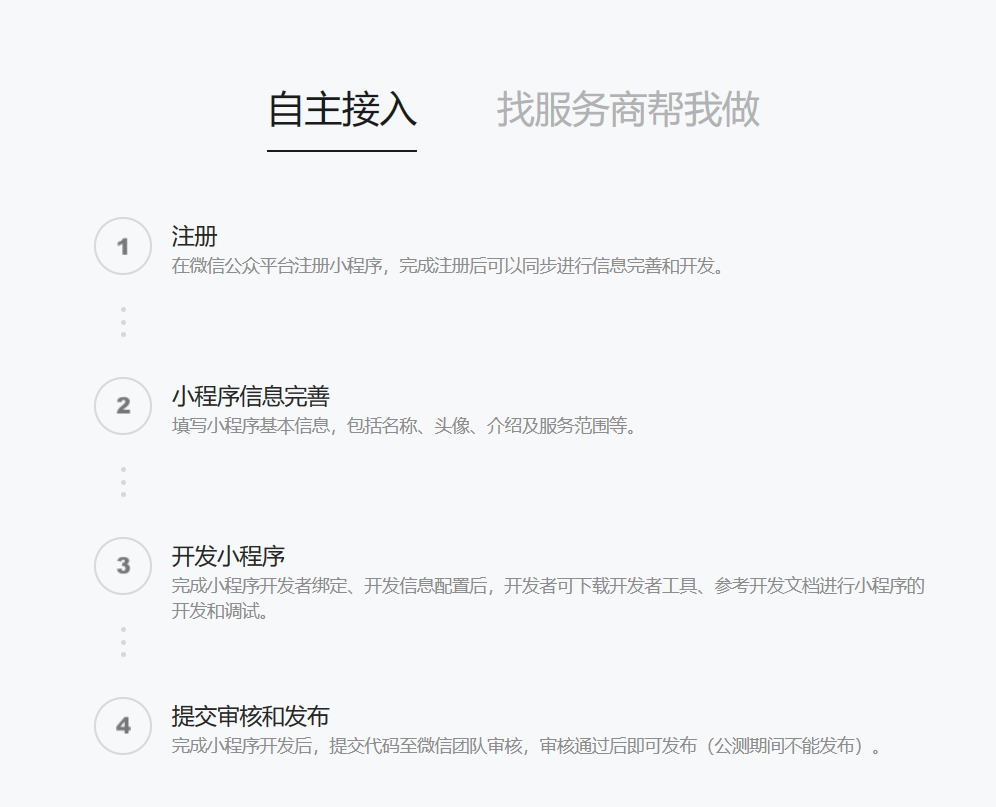

开放注册范围：


不同的注册范围享有不同的权限，个人注册范围无法接入微信支付功能

##### 准备工作

开发微信小程序之前需要做如下准备工作：

- 注册小程序
- 完善小程序信息
- 下载开发者工具

##### 入门案例

步骤

- 了解小程序目录结构
- 编写小程序代码
- 编译小程序

###### 目录结构

小程序包含一个描述整体程序的 app 和多个描述各自页面的 page。

一个小程序的主体部分由三个文件组成，必须放在项目的根目录，如下：

| 文件     | 必需 | 作用             |
| -------- | ---- | ---------------- |
| app.js   | 是   | 小程序逻辑       |
| app.json | 是   | 小程序公共配置   |
| app.wxss | 否   | 小程序公共样式表 |


一个小程序的页面由四个文件组成：

| 文件类型 | 必需 | 作用       |
| -------- | ---- | ---------- |
| js       | 是   | 页面逻辑   |
| wxml     | 是   | 页面结构   |
| json     | 否   | 页面配置   |
| wxss     | 否   | 页面样式表 |

###### 导入小程序代码

#### 微信登录

##### 微信登录流程

帮助文档：[开放能力 / 用户信息 / 小程序登录 (qq.com)](https://developers.weixin.qq.com/miniprogram/dev/framework/open-ability/login.html)


##### 需求分析与设计

##### 代码开发

```java
@Override
public UserLoginVO login(UserLoginDTO userLoginDTO) {
    // 通过前端code获得用户的openid（微信用户唯一标识）
    String openid = getOpenid(userLoginDTO.getCode());
    // 验证openid是否为空，为空则传递参数code有误，登录失败
    if (openid == null) {
        throw new LoginFailedException(MessageConstant.LOGIN_FAILED);
    }
    // 获取数据库中的该user信息
    User user = userMapper.getByOpenId(openid);
    // 如果user为空，则该用户为新用户，为其注册
    if (user == null) {
        user = User.builder().openid(openid).createTime(LocalDateTime.now()).build();
        save(user);
    }
    // 生成jwt令牌
    Map<String, Object> claims = new HashMap<>();
    claims.put(JwtClaimsConstant.USER_ID, user.getId());
    String token = JwtUtil.createJWT(jwtProperties.getUserSecretKey(), jwtProperties.getUserTtl(), claims);
    // 返回UserLoginVO对象
    return UserLoginVO.builder().id(user.getId()).openid(user.getOpenid()).token(token).build();
}

private String getOpenid(String code) {
    // 通过前端code获得用户的openid（微信用户唯一标识）
    HashMap<String, String> params = new HashMap<>();
    params.put("appid", weChatProperties.getAppid());
    params.put("secret", weChatProperties.getSecret());
    params.put("js_code", code);
    params.put("grant_type", "authorization_code");
    String response = HttpClientUtil.doGet(LOGIN_URL, params);

    JSONObject jsonObject = JSON.parseObject(response);
    return jsonObject.getString("openid");
}
```

##### 功能测试

#### 导入商品浏览功能模块

##### 需求分析与设计

###### 接口设计

- 查询分类
- 根据分类 id 查询菜品（关联口味数据）
- 根据分类 id 查询套餐
- 根据套餐 id 查询包含的菜品

##### 代码开发

##### 功能测试

### 缓存商品

#### 缓存菜品

##### 问题说明

用户端小程序展示的菜品数据都是通过查询数据库来获得，如果短时间内有大量查询请求，则数据库访问压力过大，会造成查询响应慢，用户体验差。

##### 实现思路

通过 Redis 来缓存菜品数据，减少数据库查询操作（内存访问速度比磁盘 IO 访问速度快得多）

查询思路：

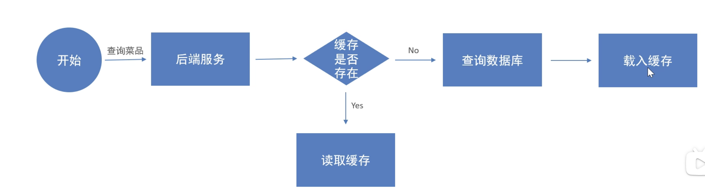

缓存逻辑分析：

- 每个分类下的菜品缓存一份数据，即一个分类对应一个 key-value 键值对
- 数据库中菜品数据有变更时要清理缓存数据

##### 代码开发

###### 查询时添加缓存

```java
@GetMapping("/list")
@ApiOperation("根据分类id查询菜品")
public Result<List<DishVO>> list(Long categoryId) {
    // 构造key
    String key = "dish_" + categoryId;
    // 查询redis中是否存在缓存数据
    String list = (String) redisTemplate.opsForValue().get(key);
    List<DishVO> data = JSON.parseArray(list, DishVO.class);
    // 存在缓存数据，直接返回给前端
    if (data != null && !data.isEmpty()) {
        return Result.success(data);
    }
    // 不存在缓存数据，则查询数据库，并添加到redis中
    // 查询
    Dish dish = new Dish();
    dish.setCategoryId(categoryId);
    dish.setStatus(StatusConstant.ENABLE);//查询起售中的菜品

    data = dishService.listWithFlavor(dish);
    // 添加
    redisTemplate.opsForValue().set(key, JSON.toJSONString(data));
    // 返回
    return Result.success(data);
}
```

###### 修改时清理缓存

修改管理端接口 DishController 的相关方法，加入清理缓存逻辑，需要改造的方法：

- 新增菜品
- 修改菜品
- 删除菜品
- 起售、停售菜品

```java
// 清理redis缓存方法
private void cleanUpCache(String pattern) {
    Set keys = redisTemplate.keys(pattern);
    redisTemplate.delete(keys);
}
```

##### 功能测试

#### 缓存套餐

##### SpringCache

###### 介绍

SpringCache 是一个框架，实现了基于==注解==的缓存功能，只需要简单地加一个注解，就能实现缓存功能

SpringCache 提供了一层抽象，底层可以切换不同的缓存实现，例如：

- EHCache
- Caffeine
- Redis

Maven 坐标

```xml
<dependency>
    <groupId>org.springframework.boot</groupId>
    <artifactId>spring-boot-starter-cache</artifactId>
</dependency>
```

该框架会根据 maven 项目中导入的数据库来选择缓存实现，即如果项目中导入了 redis 的 Java 客户端，就无需其他配置，该框架会自动选择 redis 作为底层缓存实现。

###### 常用注解

| 注解             | 说明                                                         |
| ---------------- | ------------------------------------------------------------ |
| `@EnableCaching` | 开启缓存注解功能，通常加在启动类上                           |
| `@Cacheable`     | 在方法执行前先查询缓存中是否有数据，如果有数据，则直接返回缓存数据；如果没有缓存数据，调用方法并将方法返回值放到缓存中 |
| `CachePut`       | 将方法的返回值放到缓存中                                     |
| `CacheEvict`     | 将一条或多条数据从缓存中删除                                 |

###### 入门案例

案例一

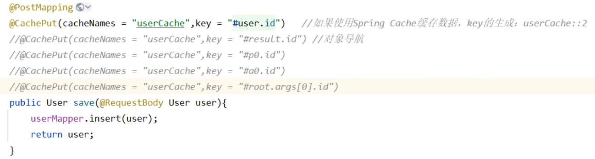

- 使用 spring 的 el 表达式来动态地生成插入 redis 的 key 的名称
- 使用 `@CachePut` 注解来将方法的返回值保存到 redis 中
- 执行顺序：先执行方法，方法执行完之后再执行注解操作缓存

案例二

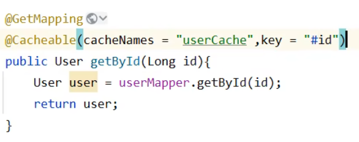

- `@Cacheable` 注解的属性同上
- 使用该注解来完成在方法执行前先查询缓存中是否有数据，如果有数据，则直接返回缓存数据；如果没有缓存数据，调用方法并将方法返回值放到缓存中
- 该注解中 el 表达式不能用 result 关键字

案例三

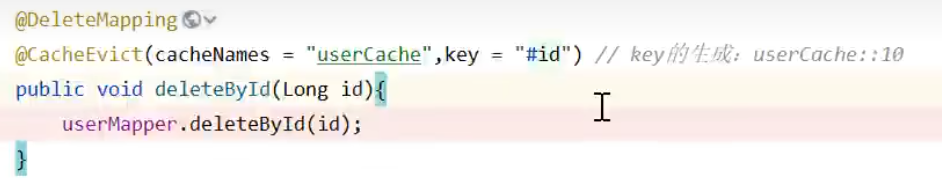

- `@CacheEvict` 注解的属性也同上
- 执行顺序：先执行方法，方法执行完之后再执行注解
- 删除单条缓存数据

案例四

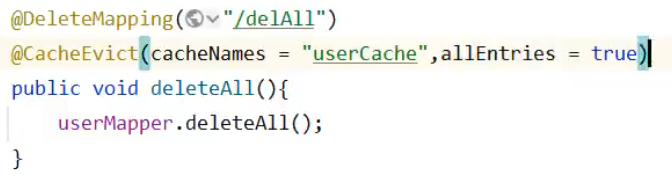

- 删除全部缓存数据
- 不使用 key 属性来指定单个 key，使用 `allEntries = true` 来指定全部前缀为 userCache 的 key

##### 实现思路

具体的实现思路如下：

- 导入 SpringCache 和 Redis 的相关 maven 坐标
- 在启动类上加入 `@EnableCaching` 注解
- 在用户端接口 SetmealController 的 list 方法上加入 `@Cacheable` 注解
- 在管理端 SetmealController 的 sava、delete、update、startOrStop 等方法上加入 `@CacheEvict` 注解

##### 代码开发

##### 功能测试

### 购物车

#### 添加到购物车

##### 需求分析和设计

接口设计：

- 请求方式：POST
- 请求路径：/user/shoppingCart/add
- 请求参数：套餐 id、菜品 id、口味
- 返回结果：code、data、msg

##### 代码开发

```java
@Override
public void addToCart(ShoppingCartDTO shoppingCartDTO) {
    // 判断当前加入购物车的商品是否已存在，已存在的话更新商品的数量+1
    Long id = BaseContext.getCurrentId();
    Long setmealId = shoppingCartDTO.getSetmealId();
    Long dishId = shoppingCartDTO.getDishId();
    String dishFlavor = shoppingCartDTO.getDishFlavor();
    LambdaQueryWrapper<ShoppingCart> wrapper = new LambdaQueryWrapper<ShoppingCart>()
        .eq(id != null, ShoppingCart::getUserId, id)
        .eq(setmealId != null, ShoppingCart::getSetmealId, setmealId)
        .eq(dishId != null, ShoppingCart::getDishId, dishId)
        .eq(dishFlavor != null, ShoppingCart::getDishFlavor, dishFlavor);
    List<ShoppingCart> list = list(wrapper);
    if (list != null && !list.isEmpty()) {
        LambdaUpdateWrapper<ShoppingCart> updateWrapper = new LambdaUpdateWrapper<ShoppingCart>()
            .eq(ShoppingCart::getId, list.get(0).getId())
            .set(ShoppingCart::getNumber, list.get(0).getNumber() + 1);
        update(updateWrapper);
        return;
    }
    // 如果当前商品不存在，则插入到购物车表中，默认数量为1
    ShoppingCart shoppingCart = new ShoppingCart();
    if (setmealId != null && dishId == null) {
        Setmeal setmeal = setMealService.getById(setmealId);
        String name = setmeal.getName();
        String image = setmeal.getImage();
        BigDecimal price = setmeal.getPrice();
        shoppingCart = ShoppingCart.builder().userId(id).name(name).setmealId(setmealId)
            .number(1).amount(price).image(image).createTime(LocalDateTime.now()).build();
    }
    if (setmealId == null && dishId != null) {
        Dish dish = dishService.getById(dishId);
        String name = dish.getName();
        String image = dish.getImage();
        BigDecimal price = dish.getPrice();
        shoppingCart = ShoppingCart.builder().userId(id).name(name).dishId(dishId)
            .number(1).amount(price).image(image).dishFlavor(dishFlavor).createTime(LocalDateTime.now()).build();
    }
    save(shoppingCart);

}
```

##### 功能测试

#### 查看购物车

#### 清空购物车

### 用户下单

#### 导入地址薄功能代码

##### 需求分析和设计

业务功能

- 查询地址列表
- 新增地址
- 修改地址
- 删除地址
- 设置默认地址
- 查询默认地址

接口设计

- 新增地址
- 查询当前登录用户的所有地址信息
- 查询默认地址
- 根据 id 修改地址
- 根据 id 删除地址
- 根据 id 查询地址
- 设置默认地址

##### 导入代码

##### 功能测试

#### 用户下单

##### 需求分析与设计

###### 用户下单业务说明：

在电商系统中，用户是通过下单的方式通知商家，用户已经购买了商品，需要商家进行备货和发货

###### 用户下单后会产生订单相关数据，订单数据需要能够体现如下信息：

- 买的哪些商品？每个商品的数量是多少（查询用户购物车获得）
- 订单总金额是多少？（程序计算得出）
- 收获地址是哪？（下单地址簿中查询）
- 哪个用户下的单？（下单地址簿中查询）
- 用户手机号是多少？（下单地址簿中查询）

###### 用户点餐业务流程：

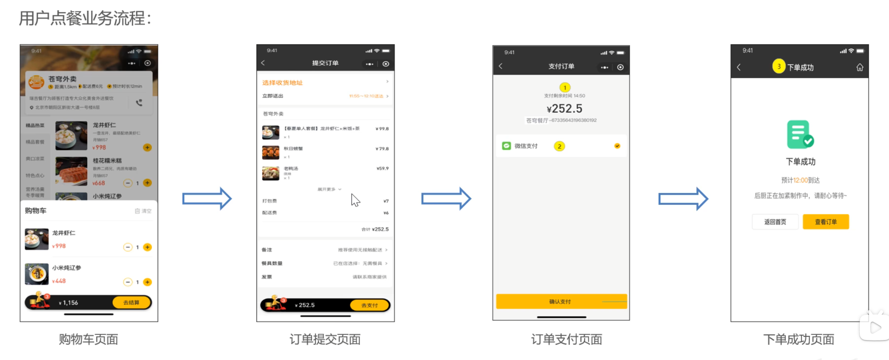

###### 接口分析：

请求方式：POST

请求路径：/user/order/submit

参数：

- 地址薄 id
- 配送状态（立即送出、选择送出时间）
- 打包费 
- 总金额
- （配送费固定为6元，本项目中不考虑了）
- 备注
- 餐具数量

返回数据：

- 用户下单时间（用于前端倒计时）
- 订单总金额
- 订单号
- 订单 id（用于支付时确定订单）

数据库设计：

- 订单表（存储订单基本信息）
  - 谁的订单？
  - 送哪去？
  - 打哪个电话联系？
  - 多少钱？
  - 什么时间下的单？
  - 什么时间支付的？
  - 订单的状态？
  - 订单号是多少？
- 订单明细表（存储订单菜品信息）
  - 当前明细属于哪个订单？
  - 具体点的是什么商品？
  - 这个商品点了几份？

##### 代码开发

```java
@Override
    @Transactional
    public OrderSubmitVO submit(OrdersSubmitDTO ordersSubmitDTO) {
        // 各种业务异常
        // 地址薄为空
        Long addressBookId = ordersSubmitDTO.getAddressBookId();
        AddressBook address = addressBookMapper.getById(addressBookId);
        if (address == null) {
            throw new OrderBusinessException(MessageConstant.ADDRESS_BOOK_IS_NULL);
        }
        // 购物车数据为空
        Long userId = BaseContext.getCurrentId();
        LambdaQueryWrapper<ShoppingCart> wrapper = new LambdaQueryWrapper<ShoppingCart>()
                .eq(userId != null, ShoppingCart::getUserId, userId);
        List<ShoppingCart> shoppingCarts = shoppingCartService.list(wrapper);
        if (shoppingCarts == null || shoppingCarts.isEmpty()) {
            throw new OrderBusinessException(MessageConstant.SHOPPING_CART_IS_NULL);
        }
        // 向订单表插入一条数据
        Orders orders = new Orders();
        BeanUtils.copyProperties(ordersSubmitDTO, orders);
        orders.setNumber(String.valueOf(System.currentTimeMillis()));
        orders.setStatus(Orders.PENDING_PAYMENT);
        orders.setUserId(userId);
        orders.setOrderTime(LocalDateTime.now());
        orders.setPayStatus(Orders.UN_PAID);
        orders.setUserName(userService.getById(userId).getName());
        orders.setPhone(address.getPhone());
        orders.setAddress(address.getDetail());
        orders.setConsignee(address.getConsignee());

        save(orders);
        // 向订单明细表插入多条数据
        Long ordersId = orders.getId();
        ArrayList<OrderDetail> orderDetails = new ArrayList<>();
        for (ShoppingCart shoppingCart : shoppingCarts) {
            OrderDetail orderDetail = new OrderDetail();
            BeanUtils.copyProperties(shoppingCart, orderDetail);
            orderDetail.setOrderId(ordersId);
            orderDetails.add(orderDetail);
        }
        orderDetailService.saveBatch(orderDetails);

        // 清空购物车
        shoppingCartService.remove(wrapper);
        // 封装返回结果
        return OrderSubmitVO.builder().id(ordersId).orderAmount(ordersSubmitDTO
                .getAmount()).orderNumber(orders.getNumber()).orderTime(orders.getOrderTime()).build();
    }
```

##### 功能测试

### 订单支付和管理

#### 微信支付介绍

##### 微信支付产品：

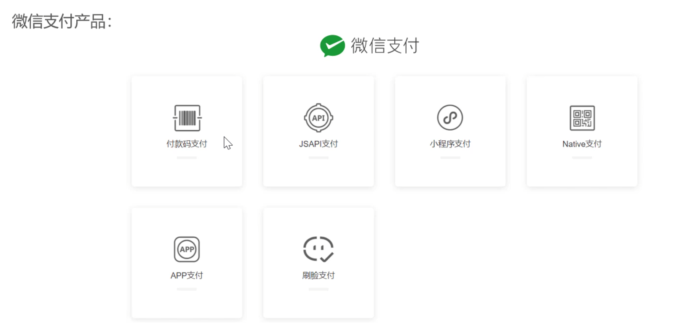

参考文档：https://pay.weixin.qq.com/static/product/product_index.shtml

##### 小程序微信支付接入流程：

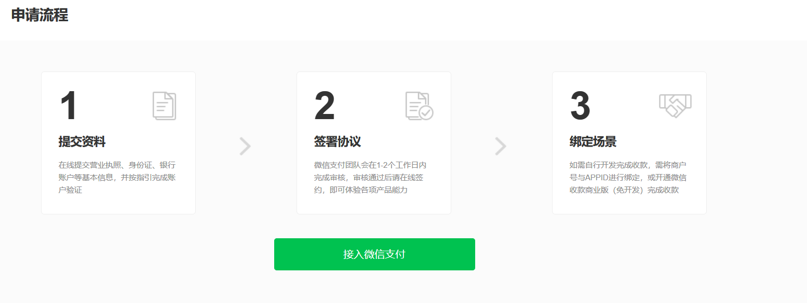

##### 微信小程序支付时序图：

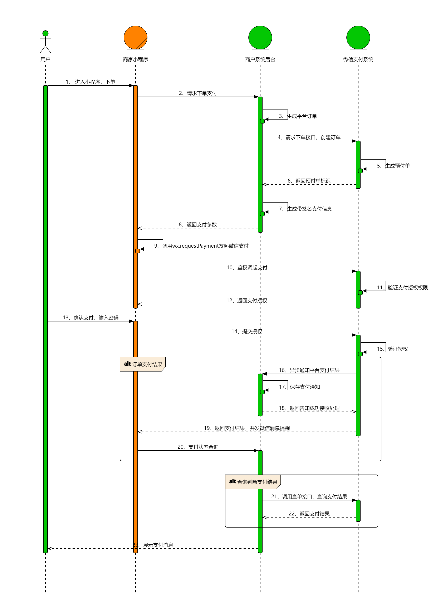

##### 请求下单接口：

- url：https://api.mch.weixin.qq.com/v3/pay/transactions/jsapi
- 请求方式：POST
- 提交参数：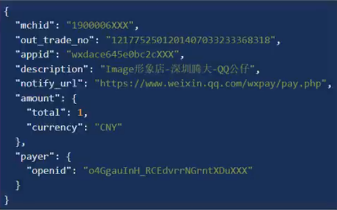
  - mchid：商户号
  - out_trade_no：订单号（自己定义的）
  - appid：小程序的 appid
  - description：描述
  - notify_url：回调地址，即调用成功后商户接收返回响应数据的地址
  - amount
    - total：总金额
    - currency：货币
  - payer
    - openid：支付者的 openid

##### 关键阶段：

- 商户系统调用下单接口
- 小程序调用 `wx.requestPayment` 方法完成支付
- 商户系统获取到支付结果，更新订单状态

##### JSAPI 下单详细说明

接口文档：[JSAPI下单 - JSAPI支付 | 微信支付商户文档中心 (qq.com)](https://pay.weixin.qq.com/docs/merchant/apis/jsapi-payment/direct-jsons/jsapi-prepay.html)

请求参数：详见接口文档

请求示例：

```json
curl -X POST \
  https://api.mch.weixin.qq.com/v3/pay/transactions/jsapi \
  -H "Authorization: WECHATPAY2-SHA256-RSA2048 mchid=\"1900000001\",..." \
  -H "Accept: application/json" \
  -H "Content-Type: application/json" \
  -d '{
    "appid" : "wxd678efh567hg6787",
    "mchid" : "1230000109",
    "description" : "Image形象店-深圳腾大-QQ公仔",
    "out_trade_no" : "1217752501201407033233368018",
    "time_expire" : "2018-06-08T10:34:56+08:00",
    "attach" : "自定义数据说明",
    "notify_url" : " https://www.weixin.qq.com/wxpay/pay.php",
    "goods_tag" : "WXG",
    "support_fapiao" : true,
    "amount" : {
      "total" : 100,
      "currency" : "CNY"
    },
    "payer" : {
      "openid" : "oUpF8uMuAJO_M2pxb1Q9zNjWeS6o\t"
    },
    "detail" : {
      "cost_price" : 608800,
      "invoice_id" : "微信123",
      "goods_detail" : [
        {
          "merchant_goods_id" : "1246464644",
          "wechatpay_goods_id" : "1001",
          "goods_name" : "iPhoneX 256G",
          "quantity" : 1,
          "unit_price" : 528800
        }
      ]
    },
    "scene_info" : {
      "payer_client_ip" : "14.23.150.211",
      "device_id" : "013467007045764",
      "store_info" : {
        "id" : "0001",
        "name" : "腾讯大厦分店",
        "area_code" : "440305",
        "address" : "广东省深圳市南山区科技中一道10000号"
      }
    },
    "settle_info" : {
      "profit_sharing" : false
    }
  }'
```

响应参数：

- 200  OK

- **prepay_id** 必填 string(64)

  > **【预支付交易会话标识】** 预支付交易会话标识。用于后续接口调用中使用，该值有效期为2小时

响应示例：

```json
{
  "prepay_id" : "wx201410272009395522657a690389285100"
}
```

##### 微信小程序调起支付

通过JSAPI下单接口获取到发起支付的必要参数prepay_id，然后使用微信支付提供的小程序方法调起小程序支付。

接口名称：wx.requestPayment

请求参数：

- **timeStamp **必填 string(32)

  > 时间戳，标准北京时间，时区为东八区，自1970年1月1日 0点0分0秒以来的秒数。注
  > 意：部分系统取到的值为毫秒级，需要转换成秒(10位数字)。

- **nonceStr** 必填 string(32)

	> 随机字符串，不长于32位。

- **package **必填 string(128)

	> 小程序下单接口返回的`prepay_id`参数值，提交格式如：`prepay_id=***`

- **signType **必填 string(32)

	> 签名类型，默认为RSA，仅支持RSA。

- **paySign **必填 string(512)

	> 签名，使用字段`appid`、`timeStamp`、`nonceStr`、`package`计算得出的签名值
	> 签名所使用的`appid`，为【小程序下单】时传入的`appid`，微信支付会校验下单与调
	> 起支付所使用的`appid`的一致性。

请求示例：

```json
wx.requestPayment
(
  {
    "timeStamp": "1414561699",
    "nonceStr": "5K8264ILTKCH16CQ2502SI8ZNMTM67VS",
    "package": "prepay_id=wx201410272009395522657a690389285100",
    "signType": "RSA",
    "paySign": "oR9d8PuhnIc+YZ8cBHFCwfgpaK9gd7vaRvkYD7rthRAZ\/X+QBhcCYL21N7cHCTUxbQ+EAt6Uy+lwSN22f5YZvI45MLko8Pfso0jm46v5hqcVwrk6uddkGuT+Cdvu4WBqDzaDjnNa5UK3GfE1Wfl2gHxIIY5lLdUgWFts17D4WuolLLkiFZV+JSHMvH7eaLdT9N5GBovBwu5yYKUR7skR8Fu+LozcSqQixnlEZUfyE55feLOQTUYzLmR9pNtPbPsu6WVhbNHMS3Ss2+AehHvz+n64GDmXxbX++IOBvm2olHu3PsOUGRwhudhVf7UcGcunXt8cqNjKNqZLhLw4jq\/xDg==",
    "success":function(res){},
    "fail":function(res){},
    "complete":function(res){}
  }
)
```

回调结果：

| 回调类型 | errMsg                               | 说明                                                         |
| :------- | :----------------------------------- | :----------------------------------------------------------- |
| success  | requestPayment:ok                    | 调用支付成功                                                 |
| fail     | requestPayment:fail cancel           | 用户取消支付                                                 |
| fail     | requestPayment:fail (detail message) | 调用支付失败，其中 `detail message` 为后台返回的详细失败原因 |

#### 微信支付准备工作

###### 调用过程如何保证数据安全？

获取微信支付平台证书、商户私钥文件：

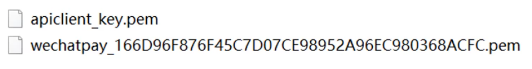

###### 微信后台如何调用到商户系统？

获取临时域名：支付成功后微信服务通过该域名回调我们的程序

使用 cpolar 进行内网穿透获得临时公网 ip

#### 代码导入

#### 功能测试

### 历史订单

### 订单状态定时处理

待实现功能：

- 支付超时订单自动取消
- 派送过久订单自动完成
- 来单提醒
- 催单提醒

#### Spring Task

##### 介绍

Spring Task 是 Spring 框架提供的任务调度工具，可以按照约定的时间**自动执行**某个代码逻辑

应用场景：

- 信用卡每月还款提醒
- 银行贷款每月还款提醒
- 火车票售票系统处理未支付订单
- 入职纪念日为用户发送通知
- 只要是需要定时处理的场景都可以使用

##### cron 表达式

cron 表达式其实就是一个字符串，通过 cron 表达式可以**定义任务触发的时间**

构成规则：分为 6 或 7 个域，由空格分隔开，每个域代表一个含义

每个域的含义分别为：秒、分、时、日、月、周、年（可选）

例如：2022 年 10 月 12 日上午 9 点整对应的表达式为："0 0 9 12 10 ? 2022"

日和周往往只能定义一个：因为日和星期几不一定能对应

cron 表达式在线生成器：[Cron - 在线Cron表达式生成器 (ciding.cc)](https://cron.ciding.cc/)

##### 入门案例

使用步骤：

1. 导入 maven 坐标 spring-context（已被包含在 `org.springframework.boot:spring-boot-starter` 中）
2. 启动类添加注解 `@EnableScheduling` 开启任务调度
3. 自定义定时任务类

#### 订单状态定时处理

##### 需求分析

用户下单后可能存在的情况

- 下单后未支付，订单一直处于 “待支付” 状态
- 用户收货后管理端未点击完成按钮，订单一直处于 “派送中” 状态

解决办法为：

- 通过定时任务每分钟检查一次是否存在支付超时的订单（下单后超过 15 分钟仍未支付则判定为支付超时订单），如果存在则修改订单状态为 “已取消”
- 通过定时任务每天凌晨 1 点检查一次是否存在 “派送中” 的订单，如果存在则修改订单状态为 “已完成”

##### 代码开发

```java
/**
 * 处理超时订单
 */
// 每分钟触发一次
@Scheduled(cron = "0 0/1 * * * ?")
public void handleTimeoutOrder() {
    // 拿到全部超时未付款的订单的id
    LambdaQueryWrapper<Orders> wrapper = new LambdaQueryWrapper<Orders>()
        // 超时的订单
        .le(Orders::getOrderTime, LocalDateTime.now().minusMinutes(15))
        // 未付款的订单
        .eq(Orders::getStatus, Orders.PENDING_PAYMENT);
    List<Long> ids = orderService.list(wrapper).stream().map(Orders::getId).collect(Collectors.toList());
    // 更新这些订单的状态为已取消
    orderService.cancelTimeoutOrder(ids);
}

/**
 * 处理派送中订单
 */
// 每天凌晨一点触发一次
@Scheduled(cron = "0 0 1 * * ?")
public void handleDeliveryInProgressOrder() {
    // 拿到全部处于派送中状态的订单的id
    LambdaQueryWrapper<Orders> wrapper = new LambdaQueryWrapper<Orders>()
        // 派送中的订单
        .eq(Orders::getStatus, Orders.DELIVERY_IN_PROGRESS)
        // 前一天的订单
        .ge(Orders::getOrderTime, LocalDateTime.now().minusDays(1));
    List<Long> ids = orderService.list(wrapper).stream().map(Orders::getId).collect(Collectors.toList());
    // 更新这些订单的状态为已完成
    orderService.completeDeliveryInProgressOrder(ids);
}
```

##### 功能测试

### 来单提醒和客户催单

#### WebSocket

##### 介绍

WebSocket 是基于 TCP 的一种新的**网络协议**。它实现了浏览器与服务器全双工通信——浏览器和服务器只需要完成一次握手，两者之间就可以创建**持久性**的连接，并进行**双向**数据传输。

WebSocket 协议和 HTTP 协议的异同点：


应用场景：

- 视频弹幕
- 网页聊天
- 体育实况更新
- 股票基金报价实时更新

##### 入门案例

实现步骤：

- 直接使用 websocket.html 页面作为 WebSocket 客户端
- 导入 WebSocket 的 maven 坐标
- 导入 WebSocket 服务端组件 webSocketServer，用于和客户端通信
- 导入配置类 WebSocketConfiguration，注册 WebSocket 的服务端组件
- 导入定时任务类 WebSocketTask，定时向客户端推送数据

#### 来单提醒

##### 需求分析与设计

用户下单并且支付成功后，需要第一时间通知外卖商家。通知的形式有如下两种：

- 语音播报
- 弹出提示框

设计：

- 通过 WebSocket 实现管理端页面和服务端保持长连接
- 当客户支付后，调用 WebSocket 的相关 API 实现服务端向管理端页面推送消息
- 管理端浏览器解析服务端推送的消息，判断是来单提醒还是客户催单，进行响应的消息提示和语音播报
- 约定服务端发送给管理端浏览器的数据格式为 JSON，字段包括：type, orderId, content
  - type 为消息类型，1 为来单提醒，2 为客户催单
  - orderId 为订单 Id
  - content 为消息内容

##### 代码开发

```java
// 来单提醒
HashMap<String, Object> map = new HashMap<>();
map.put("type", 1);
map.put("orderId", ordersDB.getId());
map.put("content", "订单号：" + outTradeNo);
String jsonString = JSON.toJSONString(map);
webSocketServer.sendToAllClient(jsonString);
```

##### 功能测试

#### 客户催单

##### 需求分析与设计

用户在小程序点击催单按钮后，需要第一时间通知外卖商家。通知的形式有如下两种：

- 语音播报
- 弹出提示框

设计：

- 通过 WebSocket 实现管理端页面和服务端保持长连接
- 当客户点击催单按钮后，调用 WebSocket 的相关 API 实现服务端向管理端页面推送消息
- 管理端浏览器解析服务端推送的消息，判断是来单提醒还是客户催单，进行响应的消息提示和语音播报
- 约定服务端发送给管理端浏览器的数据格式为 JSON，字段包括：type, orderId, content
  - type 为消息类型，1 为来单提醒，2 为客户催单
  - orderId 为订单 Id
  - content 为消息内容

##### 代码开发

设计催单接口

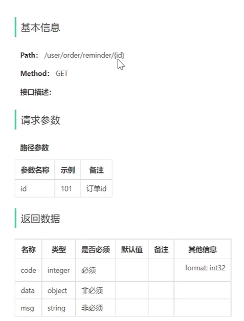

代码

```java
@Override
public void remindOrder(Long id) {
    Orders orders = getById(id);
    if (orders == null) {
        throw new OrderBusinessException(MessageConstant.ORDER_NOT_FOUND);
    }

    HashMap<String, Object> map = new HashMap<>();
    map.put("type", 2);
    map.put("orderId", id);
    map.put("content", "订单号：" + orders.getNumber());
    String jsonString = JSON.toJSONString(map);

    webSocketServer.sendToAllClient(jsonString);
}
```

##### 功能测试

## 统计报表模块

### 图形报表设计

#### Apache EChatrs

##### 介绍

Apache ECharts 是一款基于 JavaScrpit 的数据可视化图表库，提供直观、生动、可交互、可个性化定制的数据可视化图表

官网：https://echarts.apache.org/zh/index.html

##### 入门案例

根据官方提供的快速入门案例：https://echarts.apache.org/handbook/zh/get-started/

总结：使用 ECharts，重点在于研究当前图表所需的数据格式。通常是需要后端提供符合格式要求的动态数据，然后响应给前端来展示图表。

#### 营业额统计

##### 需求分析与设计

需求分析：

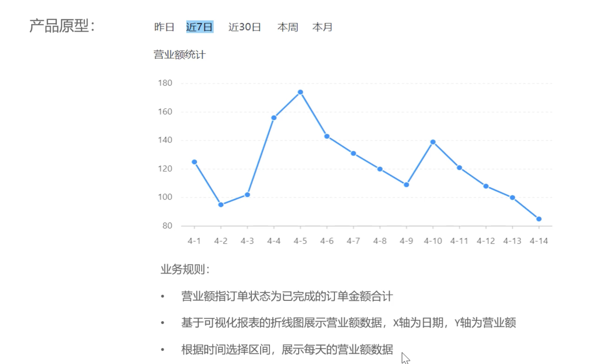

接口设计：

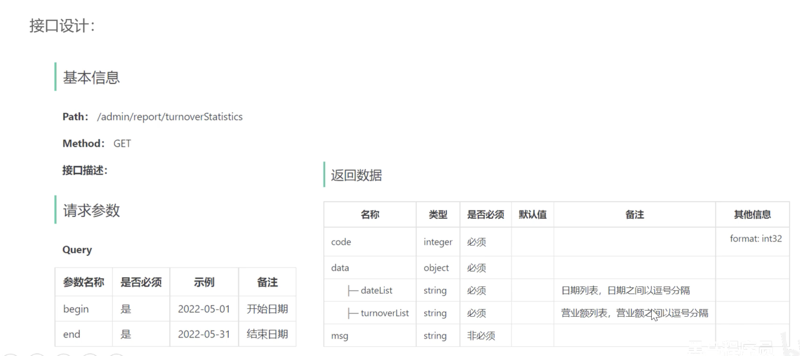

##### 代码开发

```java
@Override
public TurnoverReportVO turnoverReport(LocalDate begin, LocalDate end) {
    // 封装返回的list集合
    ArrayList<LocalDate> times = new ArrayList<>();
    times.add(begin);
    int count = 1;
    while (true) {
        LocalDate added = begin.plusDays(count++);
        if (added.isAfter(end)) {
            break;
        }
        times.add(added);
    }
    // 查询在begin和end之间每天的营业额
    ArrayList<Double> turnovers = new ArrayList<>();
    for (LocalDate time : times) {
        LocalDateTime beginTime = LocalDateTime.of(time, LocalTime.MIN);
        LocalDateTime endTime = LocalDateTime.of(time, LocalTime.MAX);
        Double turnover = reportMapper.getTurnover(beginTime, endTime);
        turnover = turnover == null ? 0.0 : turnover;
        turnovers.add(turnover);
    }

    // 封装返回数据
    return new TurnoverReportVO(StringUtils.join(times, ","), StringUtils.join(turnovers, ","));

}
```

##### 功能测试

#### 用户统计

##### 需求分析与设计

需求分析：

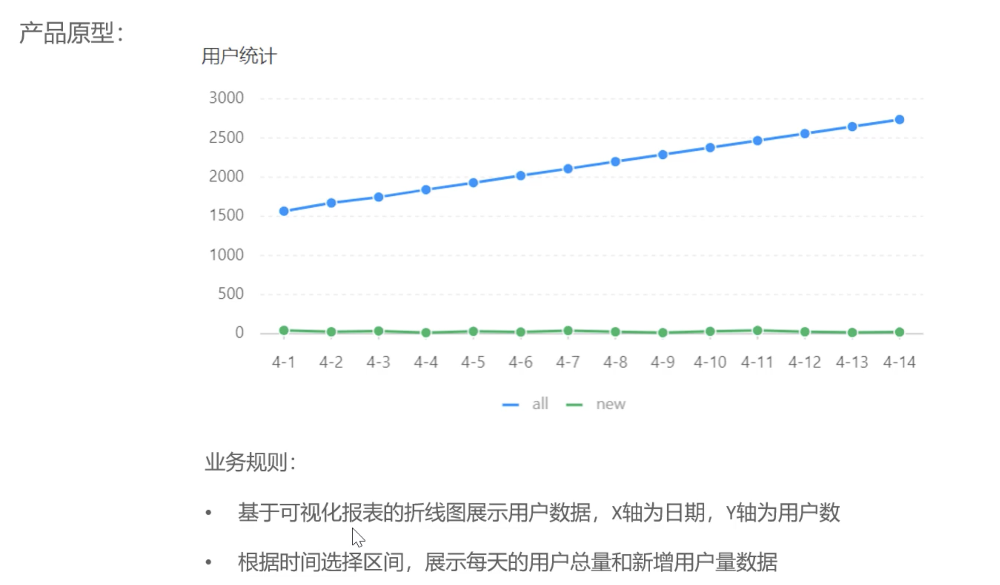

接口设计：

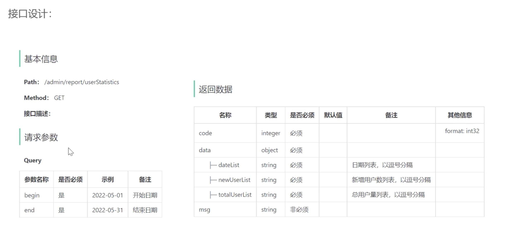

##### 代码开发

```java
@Override
public UserReportVO userReport(LocalDate begin, LocalDate end) {
    // 封装返回的list集合
    ArrayList<LocalDate> times = new ArrayList<>();
    times.add(begin);
    int count = 1;
    while (true) {
        LocalDate added = begin.plusDays(count++);
        if (added.isAfter(end)) {
            break;
        }
        times.add(added);
    }
    // 拿到每日用户总量和新增用户数量
    ArrayList<Integer> newUserNums = new ArrayList<>();
    ArrayList<Integer> totalUserNums = new ArrayList<>();
    for (LocalDate time : times) {
        LocalDateTime beginTime = LocalDateTime.of(time, LocalTime.MIN);
        LocalDateTime endTime = LocalDateTime.of(time, LocalTime.MAX);
        Integer newUserNum = reportMapper.newUserNum(beginTime, endTime);
        Integer totalUserNum = reportMapper.totalUserNum(endTime);
        // count不会返回null，只会返回0，所以不需要三元运算符判断
        newUserNums.add(newUserNum);
        totalUserNums.add(totalUserNum);
    }

    return UserReportVO.builder()
            .dateList(StringUtils.join(times, ","))
            .newUserList(StringUtils.join(newUserNums, ","))
            .totalUserList(StringUtils.join(totalUserNums, ","))
            .build();

}
```

##### 功能测试

#### 订单统计

##### 需求分析与设计

需求分析：

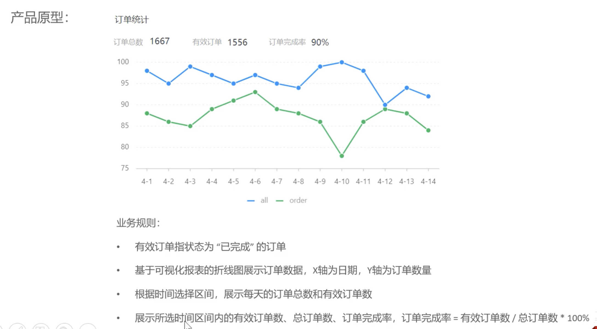

接口设计：

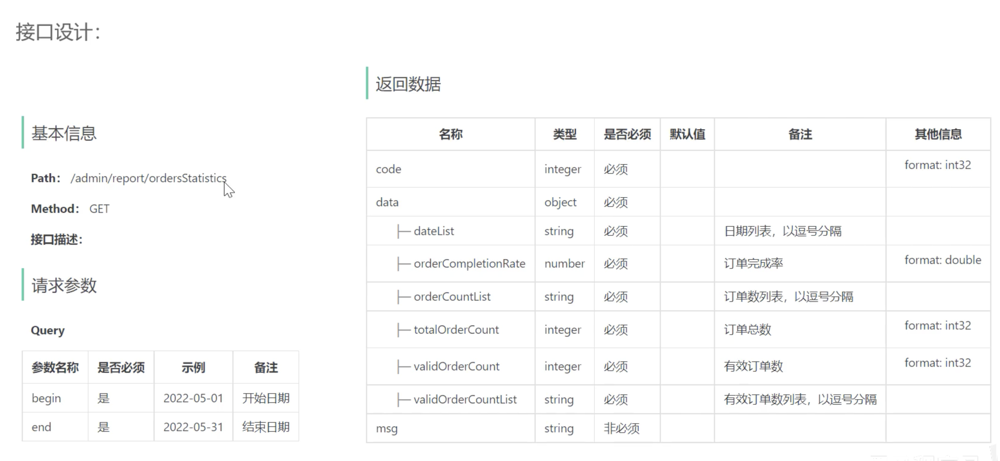

##### 代码开发

```java
@Override
public OrderReportVO orderReport(LocalDate begin, LocalDate end) {
    // 封装返回的list集合
    ArrayList<LocalDate> times = new ArrayList<>();
    times.add(begin);
    int count = 1;
    while (true) {
        LocalDate added = begin.plusDays(count++);
        if (added.isAfter(end)) {
            break;
        }
        times.add(added);
    }
    // 查询需要的订单数据
    ArrayList<Integer> totalOrderNums = new ArrayList<>();
    ArrayList<Integer> validOrderNums = new ArrayList<>();
    Integer totalNums;
    Integer validNums;
    for (LocalDate time : times) {
        LocalDateTime beginTime = LocalDateTime.of(time, LocalTime.MIN);
        LocalDateTime endTime = LocalDateTime.of(time, LocalTime.MAX);
        Integer totalOrderNum = reportMapper.totalOrderNum(beginTime, endTime);
        Integer validOrderNum = reportMapper.validOrderNum(beginTime, endTime);
        totalOrderNums.add(totalOrderNum);
        validOrderNums.add(validOrderNum);
    }
    totalNums = totalOrderNums.stream().mapToInt(Integer::intValue).sum();
    validNums = validOrderNums.stream().mapToInt(Integer::intValue).sum();
    Double completionRate = totalNums == 0 ? 0.0 : 1.0 * validNums / totalNums;
    return OrderReportVO.builder()
            .dateList(StringUtils.join(times, ","))
            .orderCountList(StringUtils.join(totalOrderNums, ","))
            .validOrderCountList(StringUtils.join(validOrderNums, ","))
            .totalOrderCount(totalNums)
            .validOrderCount(validNums)
            .orderCompletionRate(completionRate)
            .build();

}
```

##### 功能测试

#### 销量排名 top10

##### 需求分析与设计

需求分析：

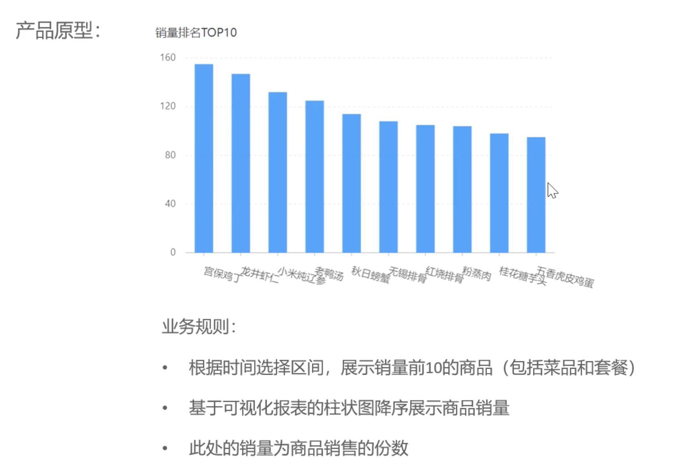

接口设计：

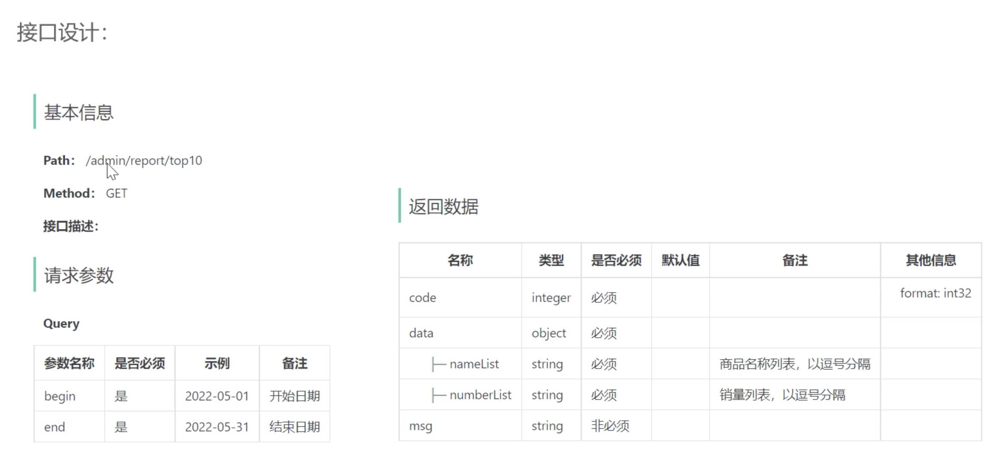

##### 代码开发


##### 功能测试

### Excel 报表统计

