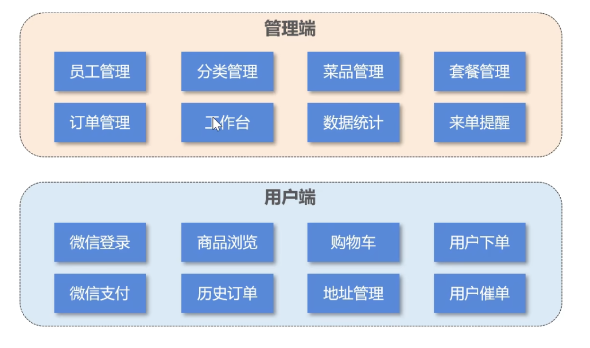
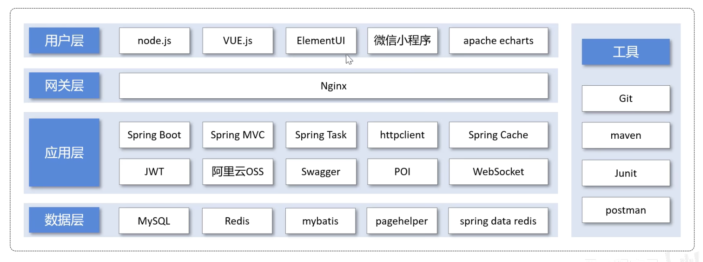

# 苍穹外卖

## 基础数据模块

### 项目概述

#### 软件开发整体介绍

##### 软件开发流程（从上至下）

1. 需求分析：需求规格说明书、产品原型
2. 设计：UI设计、数据库设计、接口设计
3. 编码：项目代码、单元测试
4. 测试：测试用例、测试报告
5. 上线运维：软件环境安装、配置

##### 角色分工

- 项目经理：对整个项目负责，**任务分配、把控进度**
- 产品经理：进行**需求调研**，输出需求调研文档、产品原型等
- UI设计师：根据产品原型输出**界面效果图**
- 架构师：项目整体**架构设计、技术选型**等
- 开发工程师：代码实现
- 测试工程师：编写测试用例、输出测试报告
- 运维工程师：软件环境搭建、项目上线

##### 软件环境

- 开发环境（development）：开发人员在开发阶段使用的环境，一般外部用户无法访问
- 测试环境（tesing）：专门给测试人员使用的环境，用于测试项目，一般外部用户无法访问
- 生产环境（production）：即线上环境，正式提供对外服务的环境

#### 苍穹外卖项目介绍

##### 项目介绍

**定位：**专门为餐饮企业（餐厅、饭店）定制的一款软件产品

功能架构：体现项目中的业务功能模块

##### 产品原型

**用于展示项目的业务功能，一般由产品经理进行设计**

一般为一组 HTML 网页，内含页面原型和需求介绍以及设计要求

##### 技术选型

**展示项目中使用到的技术框架和中间件等**

###### 用户层（主要是前端技术）：

- Node.js
- Vue.js
- ElementUI
- 微信小程序
- Apache Echarts

###### 网关层：Nginx

###### 应用层（主要是后端技术）：

- Spring Boot
- Spring MVC
- Spring Task（订单计时）
- HttpClient（发送 HTTP 请求）
- Spring Cache（缓存框架）
- JWT
- 阿里云OSS
- Swagger
- POI（操作 Excel 表格）
- WebSocket（实现催单，来单提醒。一种网络协议）

###### 数据层：

- MySQL
- Redis（数据库缓存中间件）
- MyBatis
- PageHelper
- Spring Data Redis（简化操作 Redis 的一组 API）

###### 工具：

- Git
- JUnit
- Maven
- Postman

### 环境搭建

#### 开发环境搭建

##### 前端环境搭建

##### 后端环境搭建

##### 完善登录功能

#### 导入接口文档

#### Swagger

### 员工管理

### 分类管理

### 菜品管理

### 套餐管理实战

## 点餐业务模块

### 店铺营业状态设置

### 微信登陆

### 缓存商品

### 购物车

### 用户下单

### 订单支付和管理

### 历史订单

### 订单状态定时处理

### 来单提醒和客户催单

## 统计报表模块

### 图形报表设计

### Excel 报表统计

